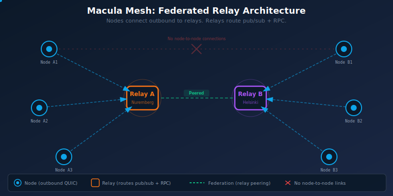
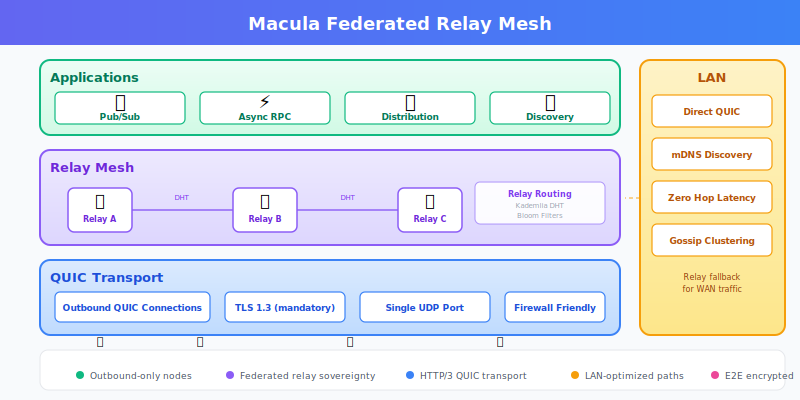
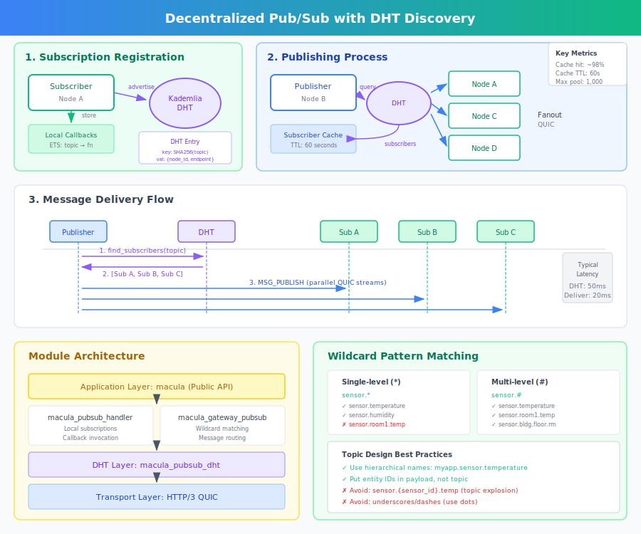
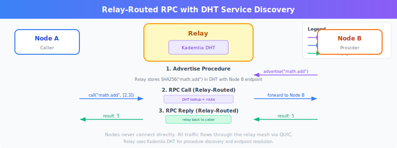
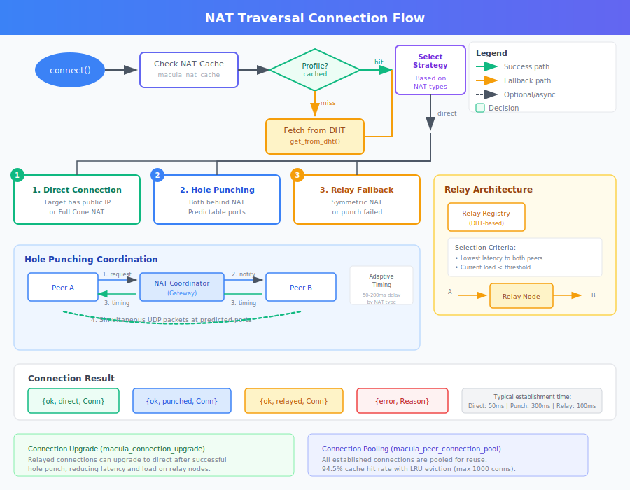
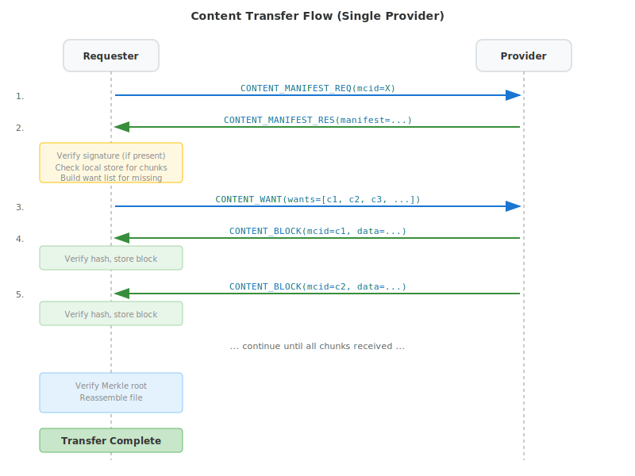
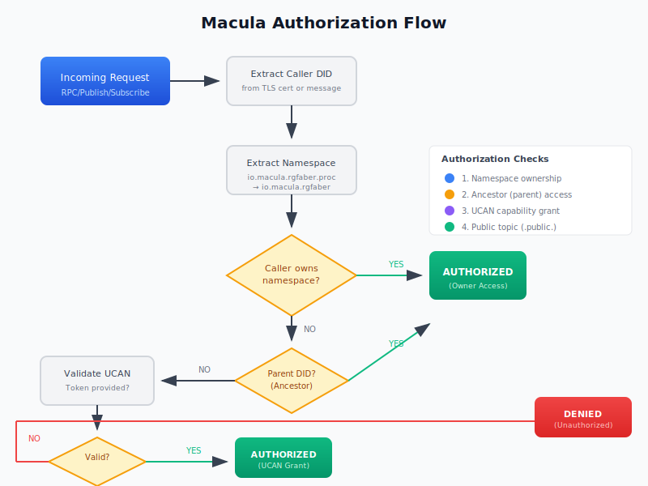
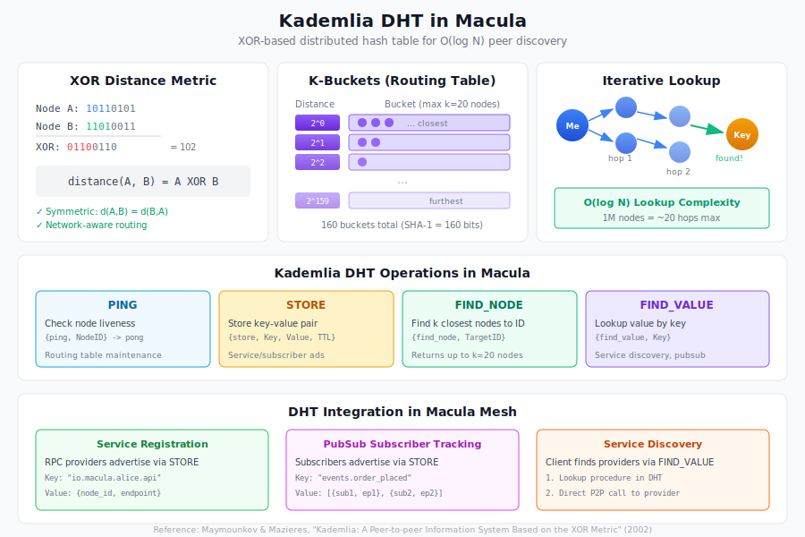

# Macula

[](LICENSE)
[](https://www.erlang.org)
[](https://hex.pm/packages/macula)
[](https://buymeacoffee.com/beamologist)

<p align="center">
  
</p>

<p align="center">
  <strong>BEAM-native HTTP/3 mesh networking for decentralized applications</strong>
</p>

---

## What is Macula?

Macula is an **Erlang/OTP library** that provides a complete distributed mesh networking stack over HTTP/3 (QUIC). It enables BEAM applications to form self-organizing networks with:

- **Zero configuration clustering** via UDP multicast gossip
- **NAT-friendly transport** using QUIC (single UDP port)
- **Decentralized service discovery** via Kademlia DHT
- **Capability-based security** with DID identities and UCAN tokens

<p align="center">
  
</p>

---

## Features

### Mesh Networking

<p align="center">
  
</p>

| Feature | Description |
|---------|-------------|
| **HTTP/3 over QUIC** | NAT-friendly, firewall-friendly, built-in TLS 1.3 |
| **Kademlia DHT** | Decentralized routing with O(log N) lookups |
| **Multi-tenant realms** | Isolated namespaces for different applications |
| **Connection pooling** | 94.5% hit rate, LRU eviction |

### Pub/Sub Messaging

<p align="center">
  
</p>

```erlang
%% Subscribe to a topic
ok = macula:subscribe(Peer, <<"sensors.temperature">>, fun(Msg) ->
    io:format("Received: ~p~n", [Msg])
end).

%% Publish to subscribers
ok = macula:publish(Peer, <<"sensors.temperature">>, #{value => 23.5}).
```

### RPC (Request/Response)

<p align="center">
  
</p>

```erlang
%% Register a procedure handler
ok = macula:register(Peer, <<"math.add">>, fun(#{a := A, b := B}) ->
    {ok, #{result => A + B}}
end).

%% Call the procedure (discovers provider via DHT)
{ok, #{result := 5}} = macula:call(Peer, <<"math.add">>, #{a => 2, b => 3}).
```

### NAT Traversal

<p align="center">
  
</p>

| Technique | Status | Description |
|-----------|--------|-------------|
| **Hole Punching** | Adaptive | Direct P2P through NAT |
| **STUN-like Probing** | Built-in | Reflexive address detection |
| **Relay Fallback** | Automatic | When direct fails |
| **Connection Upgrade** | Transparent | Relay → Direct when possible |

### Gossip Clustering

<p align="center">
  
</p>

Zero-configuration cluster formation using UDP multicast:

```erlang
%% Start gossip-based clustering
ok = macula_cluster:start_cluster(#{
    strategy => gossip,
    secret => <<"my_cluster_secret">>  %% Optional HMAC authentication
}).

%% Nodes auto-discover via multicast 230.1.1.251:45892
```

### Content Transfer (P2P Artifacts)

<p align="center">
  
</p>

Content-addressed storage and transfer for distributing OTP releases across the mesh:

```erlang
%% Publish a file to the mesh
{ok, MCID} = macula_content:publish("/path/to/release.tar.gz").

%% Fetch from any provider
{ok, Binary} = macula_content:fetch(MCID).
```

| Feature | Description |
|---------|-------------|
| **MCID** | Content-addressed identifiers (BLAKE3/SHA256) |
| **Merkle verification** | Chunk-level integrity |
| **Parallel download** | From multiple providers |
| **Want/Have/Block** | Efficient P2P protocol |

### Authorization (DID + UCAN)

<p align="center">
  
</p>

Decentralized capability-based authorization:

| Component | Purpose |
|-----------|---------|
| **DID** | Decentralized identifiers for namespace ownership |
| **UCAN** | Capability tokens for delegated permissions |
| **Namespace** | `did:macula:io.example.user` owns `io.example.user.*` |

### Hierarchical DHT (Bridge System)

<p align="center">
  
</p>

Fractal mesh hierarchy with query escalation:

```
Cluster → Street → Neighborhood → City → Province → Country → Region → Global
```

When a DHT query fails locally, it escalates to parent levels with results cached at lower levels.

---

## Quick Start

### Installation

Add to your `rebar.config`:

```erlang
{deps, [
    {macula, "0.19.2"}
]}.
```

Or in Elixir `mix.exs`:

```elixir
defp deps do
  [
    {:macula, "~> 0.19.2"}
  ]
end
```

### Basic Usage

```erlang
%% Start macula application
application:ensure_all_started(macula).

%% Connect to the mesh
{ok, Peer} = macula:connect(<<"quic://seed.example.com:9443">>, #{
    realm => <<"io.example.myapp">>,
    node_id => <<"node-001">>
}).

%% Subscribe to events
macula:subscribe(Peer, <<"events.orders">>, fun(Order) ->
    process_order(Order)
end).

%% Make RPC calls
{ok, Result} = macula:call(Peer, <<"inventory.check">>, #{sku => <<"ABC123">>}).
```

---

## Configuration

### Environment Variables

| Variable | Default | Description |
|----------|---------|-------------|
| `MACULA_QUIC_PORT` | `9443` | QUIC listener port |
| `MACULA_REALM` | `com.example.realm` | Default realm |
| `HEALTH_PORT` | `8080` | Health check HTTP port |
| `MACULA_TLS_MODE` | `development` | TLS mode (`production`/`development`) |
| `CLUSTER_STRATEGY` | `gossip` | Cluster strategy (`gossip`/`static`/`mdns`) |
| `CLUSTER_SECRET` | - | Shared secret for gossip HMAC |

### Application Config

```erlang
{macula, [
    {quic_port, 9443},
    {realm, <<"io.example.myapp">>},
    {tls_mode, production},
    {tls_cacertfile, "/etc/ssl/certs/ca-certificates.crt"}
]}.
```

---

## Documentation

| Guide | Description |
|-------|-------------|
| [Cluster API Guide](docs/guides/CLUSTER_API_GUIDE.md) | Clustering and distribution |
| [Gossip Clustering Guide](docs/guides/GOSSIP_CLUSTERING_GUIDE.md) | UDP multicast discovery |
| [Content Transfer Guide](docs/guides/CONTENT_TRANSFER_GUIDE.md) | P2P artifact distribution |
| [NAT Traversal Guide](docs/guides/NAT_TRAVERSAL_DEVELOPER_GUIDE.md) | NAT techniques |
| [DHT Guide](docs/guides/DHT_GUIDE.md) | Kademlia DHT internals |
| [Authorization Guide](docs/guides/AUTHORIZATION_GUIDE.md) | DID/UCAN security |
| [TLS Configuration](docs/operator/TLS_CONFIGURATION.md) | Production TLS setup |

---

## Version History

| Version | Date | Highlights |
|---------|------|------------|
| **v0.19.2** | Jan 2026 | README rework with feature sections and SVGs |
| **v0.19.1** | Jan 2026 | Gossip clustering, static strategy (34 tests) |
| **v0.19.0** | Jan 2026 | Content transfer system, MCID, Want/Have/Block (171 tests) |
| **v0.18.0** | Jan 2026 | Cluster API for bc_gitops integration (19 tests) |
| **v0.16.0** | Dec 2025 | Registry system, Ed25519 signing (60 tests) |
| **v0.15.0** | Dec 2025 | Gossip protocol, CRDT replication (29 tests) |
| **v0.14.0** | Dec 2025 | Masterless CRDT architecture (48 tests) |
| **v0.13.0** | Dec 2025 | Hierarchical DHT, bridge system (40 tests) |
| **v0.12.0** | Nov 2025 | Complete NAT traversal (70 tests) |

See [CHANGELOG.md](CHANGELOG.md) for full history.

---

## Architecture

Macula follows an **always-on architecture** where every node has all capabilities:

```
macula_root (application supervisor)
├── macula_routing_server (Kademlia DHT)
├── macula_nat_system (NAT traversal)
├── macula_bootstrap_system (mesh discovery)
├── macula_gateway_system (QUIC transport)
├── macula_bridge_system (hierarchical mesh)
├── macula_platform_system (CRDT coordination)
├── macula_registry_system (package distribution)
├── macula_content_system (P2P content transfer)
└── macula_dist_system (Erlang distribution)
```

---

## Related Projects

| Project | Description |
|---------|-------------|
| [macula-ecosystem](https://github.com/macula-io/macula-ecosystem) | Documentation hub |
| [macula-console](https://github.com/macula-io/macula-console) | Management console |
| [bc-gitops](https://github.com/beam-campus/bc-gitops) | GitOps reconciler |
| [macula-tweann](https://github.com/macula-io/macula-tweann) | Neuroevolution framework |

---

## Community

- **Hex.pm**: [hex.pm/packages/macula](https://hex.pm/packages/macula)
- **GitHub**: [github.com/macula-io/macula](https://github.com/macula-io/macula)
- **Issues**: [github.com/macula-io/macula/issues](https://github.com/macula-io/macula/issues)

---

## License

Apache 2.0 - See [LICENSE](LICENSE) for details.

---

<p align="center">
  <sub>Built with the BEAM</sub>
</p>
