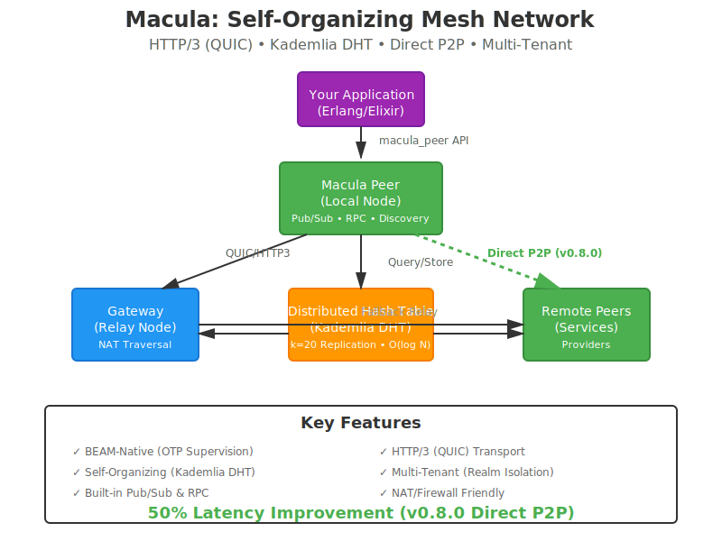

  

  <h1>Macula HTTP/3 Mesh</h1>
  
<em>Self-organizing distributed mesh for decentralized applications</em>

  

    
    
    
  

---

  

  
<strong>BEAM-Native • HTTP/3 (QUIC) • Kademlia DHT • NAT Traversal • Multi-Tenant • Platform Layer</strong>

---

## Documentation

- 🚀 **[Getting Started](GETTING_STARTED.md)** - Installation, quick start, code examples
- 🏗️ **[Architecture Guide](ARCHITECTURE.md)** - Visual guide with C4 diagrams, deployment topologies
- 📄 **[Changelog](CHANGELOG.md)** - Version history and migration guides
- 🧪 **[Development Guide](docs/DEVELOPMENT.md)** - Contributing and testing
- 🌐 **[DHT Guide](docs/guides/DHT_GUIDE.md)** - Kademlia DHT architecture

---

## Latest Release: v0.14.0 (2025-12-01)

**Masterless CRDT Architecture (v0.14.0):**
- ✅ Ra/Raft consensus **removed** - fully masterless operation
- ✅ OR-Set CRDT for distributed membership
- ✅ G-Counter and PN-Counter CRDTs for distributed counters
- ✅ LWW-Register CRDT for eventually-consistent state

**Hierarchical DHT with Bridge System (v0.13.0):**
- ✅ Fractal mesh hierarchy (Cluster → Street → City → Region)
- ✅ Query escalation to parent levels on local cache miss
- ✅ TTL-based caching with LRU eviction

**NAT Traversal & Connectivity (v0.12.x):**
- ✅ Complete NAT traversal with hole-punching and relay fallback
- ✅ Connection pooling with 94.5% hit rate
- ✅ NATS-style async RPC with direct P2P delivery

---

## Community

- **Hex**: [hex.pm/packages/macula](https://hex.pm/packages/macula)
- **GitHub**: [github.com/macula-io/macula](https://github.com/macula-io/macula)
- **Issues**: [github.com/macula-io/macula/issues](https://github.com/macula-io/macula/issues)

---

**Built with ❤️ for the BEAM community**
