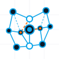
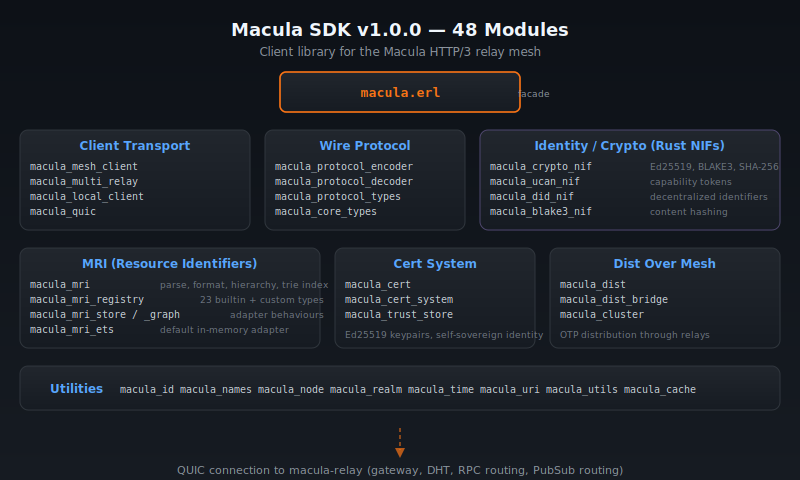
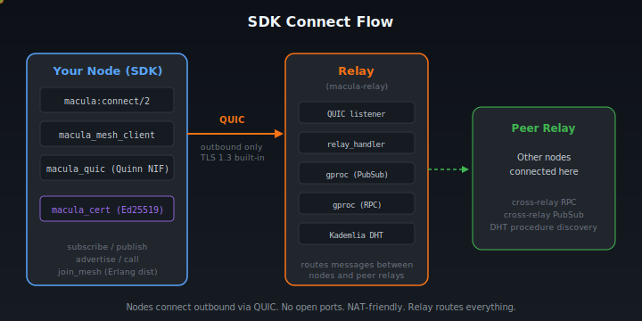
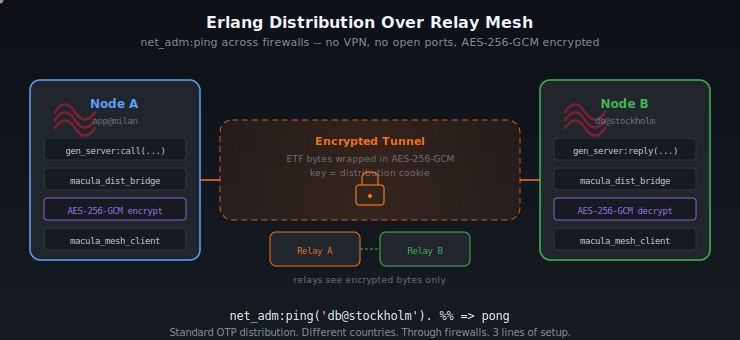
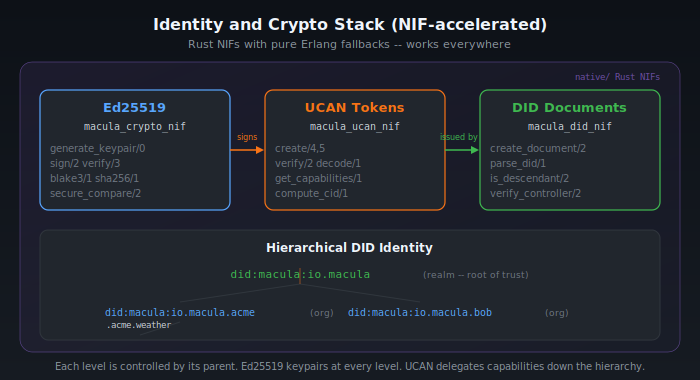
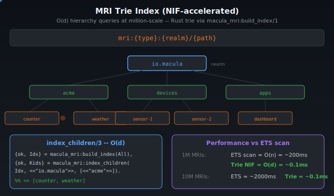

# Macula SDK

[](LICENSE)
[](https://www.erlang.org)
[](https://hex.pm/packages/macula)
[](https://buymeacoffee.com/rlefever)

<p align="center">
  
</p>

<p align="center">
  <strong>Erlang/OTP client SDK for the Macula HTTP/3 relay mesh</strong>
</p>

---

## What is Macula?

<p align="center">
  
</p>

Macula is an **Erlang/OTP client SDK** for building applications that connect to a [Macula relay mesh](https://codeberg.org/macula-io/macula-relay). It provides:

- **Pub/Sub messaging** -- topic-based event distribution across the mesh
- **RPC (request/response)** -- service discovery and invocation via DHT
- **Erlang distribution over relay** -- `net_adm:ping` across firewalls, no VPN
- **Identity** -- Ed25519 keypairs, UCAN tokens, DID documents (NIF-accelerated)
- **MRI** -- Macula Resource Identifiers for typed, hierarchical resource addressing
- **Zero-config clustering** -- UDP multicast gossip for LAN nodes

Nodes connect **outbound** to relays over QUIC. No open ports, NAT-friendly.

---

## Quick Start

Add to `rebar.config`:

```erlang
{deps, [
    {macula, "1.1.0"}
]}.
```

Or in Elixir `mix.exs`:

```elixir
defp deps do
  [{:macula, "~> 1.0"}]
end
```

<p align="center">
  
</p>

### Connect and Communicate

```erlang
%% Start macula
application:ensure_all_started(macula).

%% Connect to the mesh via a relay
{ok, Client} = macula:connect(<<"quic://boot.macula.io:443">>, #{
    realm => <<"io.example.myapp">>
}).

%% Subscribe to events
{ok, _SubRef} = macula:subscribe(Client, <<"sensors.temperature">>, fun(Msg) ->
    io:format("Received: ~p~n", [Msg])
end).

%% Publish to subscribers
ok = macula:publish(Client, <<"sensors.temperature">>, #{value => 23.5}).

%% Advertise an RPC procedure
{ok, _Ref} = macula:advertise(Client, <<"math.add">>, fun(#{a := A, b := B}) ->
    {ok, #{result => A + B}}
end).

%% Call a procedure (relay discovers the provider)
{ok, #{result := 5}} = macula:call(Client, <<"math.add">>, #{a => 2, b => 3}).
```

### Erlang Distribution Over Mesh

<p align="center">
  
</p>

Full OTP distribution tunneled through the relay mesh. No VPNs, no open ports.

```erlang
%% Single call to join the mesh with distribution
macula:join_mesh(#{
    realm => <<"io.macula">>,
    relays => [<<"quic://boot.macula.io:443">>],
    site => #{name => <<"my-site">>, lat => 51.5, lng => -0.1}
}).

%% Standard OTP distribution now works across firewalls
net_adm:ping('other@remote-host').  %% => pong
gen_server:call({Name, 'other@remote-host'}, Request).  %% works
```

### LAN Clustering

Zero-configuration cluster formation using UDP multicast:

```erlang
ok = macula_cluster:start_cluster(#{
    strategy => gossip,
    secret => <<"my_cluster_secret">>
}).
%% Nodes auto-discover via multicast 230.1.1.251:45892
```

---

## Identity and Crypto (NIF-accelerated)

<p align="center">
  
</p>

Built-in Rust NIFs with pure Erlang fallbacks for all operations:

```erlang
%% Ed25519 keypair
{ok, {PubKey, PrivKey}} = macula_crypto_nif:generate_keypair().
{ok, Sig} = macula_crypto_nif:sign(<<"hello">>, PrivKey).
true = macula_crypto_nif:verify(<<"hello">>, Sig, PubKey).

%% BLAKE3 hashing
Hash = macula_crypto_nif:blake3(Data).

%% UCAN capability tokens
{ok, Token} = macula_ucan_nif:create(Issuer, Audience, Caps, PrivKey).
{ok, Payload} = macula_ucan_nif:verify(Token, PubKey).

%% DID documents
{ok, Doc} = macula_did_nif:create_document(<<"did:macula:io.example">>, PubKey).
```

## MRI (Resource Identifiers)

<p align="center">
  
</p>

Typed, hierarchical resource addressing: `mri:{type}:{realm}/{path}`

```erlang
{ok, Parsed} = macula_mri:parse(<<"mri:app:io.macula/acme/counter">>).
%% #{type => app, realm => <<"io.macula">>, path => [<<"acme">>, <<"counter">>]}

MRI = macula_mri:new_app(<<"io.macula">>, <<"acme">>, <<"counter">>).
%% <<"mri:app:io.macula/acme/counter">>

%% Trie index for million-scale hierarchy queries
{ok, Idx} = macula_mri:build_index(MRIs).
{ok, Children} = macula_mri:index_children(Idx, <<"io.macula">>, [<<"acme">>]).
```

23 built-in types: realm, org, user, app, service, artifact, instance, license, cert, key, topic, proc, content, device, cluster, location, zone, network, model, dataset, config, class, taxonomy. Custom types via `macula_mri_registry`.

---

## Documentation

| Guide | Description |
|-------|-------------|
| [PubSub Guide](docs/guides/PUBSUB_GUIDE.md) | Topic-based messaging |
| [RPC Guide](docs/guides/RPC_GUIDE.md) | Request/response patterns |
| [Distribution Over Mesh](docs/guides/DIST_OVER_MESH_GUIDE.md) | Erlang dist through relays |
| [Clustering Guide](docs/guides/CLUSTERING_GUIDE.md) | LAN gossip clustering |
| [Authorization Guide](docs/guides/AUTHORIZATION_GUIDE.md) | DID/UCAN security |
| [MRI Guide](docs/guides/MRI_GUIDE.md) | Resource identifiers |
| [Development Guide](docs/guides/DEVELOPMENT.md) | Building and testing |
| [Glossary](docs/GLOSSARY.md) | Terminology |

For relay server documentation, see [macula-relay](https://codeberg.org/macula-io/macula-relay).

---

## SDK Modules (45)

| Group | Modules |
|-------|---------|
| **Facade** | `macula`, `macula_app`, `macula_root` |
| **Client Transport** | `macula_mesh_client`, `macula_multi_relay`, `macula_quic`, `macula_relay_discovery`, `macula_tls` |
| **Wire Protocol** | `macula_protocol_encoder`, `macula_protocol_decoder`, `macula_protocol_types`, `macula_core_types` |
| **Crypto / Identity** | `macula_crypto_nif`, `macula_blake3_nif`, `macula_ucan_nif`, `macula_did_nif` |
| **Cert System** | `macula_cert`, `macula_cert_system`, `macula_trust_store` |
| **MRI** | `macula_mri`, `macula_mri_nif`, `macula_mri_registry`, `macula_mri_store`, `macula_mri_graph`, `macula_mri_ets` |
| **Dist Over Mesh** | `macula_dist`, `macula_dist_bridge`, `macula_dist_bridge_sup`, `macula_dist_discovery`, `macula_dist_relay`, `macula_dist_mdns_advertiser`, `macula_dist_system`, `macula_cluster`, `macula_cluster_gossip`, `macula_cluster_static`, `macula_cluster_strategy` |
| **Utilities** | `macula_id`, `macula_names`, `macula_node`, `macula_realm`, `macula_time`, `macula_uri`, `macula_utils`, `macula_cache`, `macula_console` |

Server modules (gateway, DHT routing, RPC routing, PubSub routing, SWIM, peering, bootstrap, bridge, content, registry) live in [macula-relay](https://codeberg.org/macula-io/macula-relay).

---

## Related Projects

| Project | Description |
|---------|-------------|
| [macula-relay](https://codeberg.org/macula-io/macula-relay) | Relay server (hub-spoke routing, DHT, peering) |
| [macula-mri-khepri](https://codeberg.org/macula-io/macula-mri-khepri) | Distributed MRI persistence (Khepri/Raft) |
| [macula-ecosystem](https://codeberg.org/macula-io/macula-ecosystem) | Documentation hub |
| [hecate-daemon](https://codeberg.org/hecate-social/hecate-daemon) | AI agent sidecar for mesh |

---

## License

Apache 2.0 - See [LICENSE](LICENSE) for details.

---

<p align="center">
  <sub>Built with the BEAM</sub>
</p>
