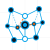
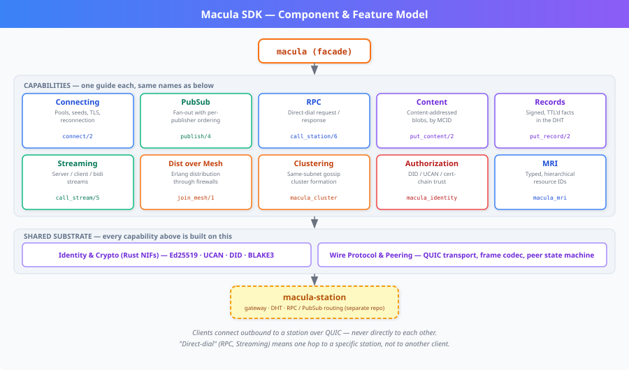
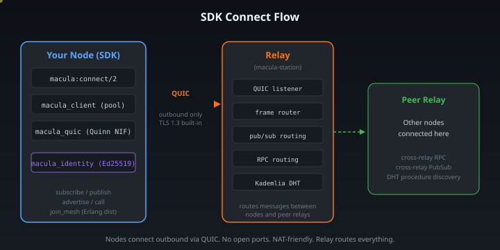
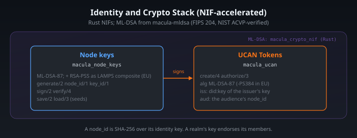

# Macula SDK

[](LICENSE)
[](https://www.erlang.org)
[](https://hex.pm/packages/macula)
[](https://buymeacoffee.com/rlefever)

<p align="center">
  
</p>

<p align="center">
  <strong>Erlang/OTP client SDK for the Macula HTTP/3 mesh</strong>
</p>

---

> **Latest — 9.2.0**: three new supervised primitive pairs —
> `macula_feeder`/`macula_downloader` (content), `macula_streamer`/
> `macula_stream_sink` (RPC streaming), `macula_responder`/`macula_requester`
> (unary RPC) — plus `macula_subscriber` for pub/sub. Each wraps its raw
> SDK primitive as an OTP behaviour with a `simple_one_for_one` factory
> supervisor, and publishes mesh-visible protocol facts (`sharing.*_v1`,
> `streaming.*_v1`, `rpc.*_v1`) around its own side of the operation. Fully
> additive, no breaking changes. See [CHANGELOG.md](CHANGELOG.md).
> 9.1.1 checked every guide and this README line-by-line against real
> source — fabricated modules, a nonexistent legacy RPC API, a dead
> dependency pin, and a dozen other doc bugs found and fixed, no behavior
> change. 9.1.0 added OTP 29 readiness (bare `catch` rewritten to `try/catch/end`;
> `macula_record`'s `record()` type renamed `m_record()`) and the
> [Records Guide](docs/guides/RECORDS_GUIDE.md). **9.0.0 was breaking**: LAN
> clustering and
> distribution-over-mesh split into independent concerns —
> `macula_cluster_system/` vs. `macula_dist_system/`. `macula_dist_relay` is
> renamed `macula_dist_pool` (the facade, `join_mesh/1` / `join_dist_relay/1`,
> is unaffected); the `auto_cluster` sys.config option is removed (start
> clustering explicitly via `macula_cluster:start_cluster/1`). See
> [CHANGELOG.md](CHANGELOG.md) for the full history.

## What is Macula?

<p align="center">
  
</p>

Macula is an **Erlang/OTP client SDK** for building applications on a mesh of
**stations** — realm-agnostic relays that route over QUIC (HTTP/3) and form a
Kademlia DHT. Your service or daemon connects **outbound** to one or more
stations: no open ports, NAT-friendly, no VPN. It provides:

- **RPC (request/response)** — discover a provider in the DHT, then **dial its
  serving station directly** (one hop), with optional realm-CA trust verification.
- **Pub/Sub** — topic-based event fan-out across stations, with per-publisher
  ordered delivery.
- **Content** — content-addressed sharing and live streaming (MCID).
- **DHT records** — signed, TTL'd records (advertisements, endpoints, more).
- **Erlang distribution over mesh** — `net_adm:ping` across firewalls, no VPN.
- **Identity** — Ed25519 keypairs, UCAN tokens, DID documents (NIF-accelerated).
- **MRI** — typed, hierarchical resource identifiers.
- **Zero-config LAN clustering** — UDP-multicast gossip.

The station (routing, DHT, SWIM, peering) is a separate repo,
[macula-station](https://github.com/macula-io/macula-station); this package is
the client you build against.

---

## Quick Start

Add to `rebar.config`:

```erlang
{deps, [{macula, "~> 9.1"}]}.
```

Or in Elixir `mix.exs`:

```elixir
defp deps do
  [{:macula, "~> 9.1"}]
end
```

<p align="center">
  
</p>

```erlang
application:ensure_all_started(macula),

%% Connect a pool to one or more stations (seed URLs). The pool owns one
%% QUIC link per seed, reconnecting and replaying subscriptions as needed.
{ok, Pool} = macula:connect([<<"quic://boot.macula.io:443">>], #{}),

%% A realm is a 32-byte tag derived from a name; it scopes every call.
Realm = macula_realm:id(<<"io.example.myapp">>),

%% Subscribe (delivers {macula_event, Ref, Topic, Payload, Meta} to a pid),
{ok, Ref} = macula:subscribe(Pool, Realm, <<"sensors.temperature">>, self()),

%% or subscribe with a callback fun(Topic, Payload, Meta):
{ok, Ref2} = macula:subscribe_callback(
    Pool, Realm, <<"sensors.temperature">>,
    fun(_Topic, Payload, _Meta) -> io:format("~p~n", [Payload]) end),

%% Publish. Entity IDs go in the PAYLOAD, never in the topic.
ok = macula:publish(Pool, Realm, <<"sensors.temperature">>,
                    #{sensor => <<"kitchen">>, value => 23.5}),

%% Advertise an RPC procedure (open to any identified caller here),
ok = macula:advertise(Pool, Realm, <<"math.add">>,
                      fun(#{<<"a">> := A, <<"b">> := B}) -> {ok, A + B} end,
                      #{}),

%% Call it — the SDK resolves the provider and dials its station directly.
{ok, 5} = macula:call(Pool, Realm, <<"math.add">>,
                      #{<<"a">> => 2, <<"b">> => 3}, 5_000).
```

---

## Identity and Crypto (NIF-accelerated)

<p align="center">
  
</p>

Rust NIFs with pure-Erlang fallbacks:

```erlang
%% Ed25519 keypair (a #{public := _, private := _} map)
KP  = macula_identity:generate(),
Sig = macula_identity:sign(<<"hello">>, KP),
true = macula_identity:verify(<<"hello">>, Sig, macula_identity:public(KP)),

%% BLAKE3 hashing
Hash = macula_blake3_nif:hash(Data),

%% UCAN capability tokens + DID documents
{ok, Token}   = macula_ucan_nif:create(Issuer, Audience, Caps, PrivKey),
{ok, Payload} = macula_ucan_nif:verify(Token, PubKey).
```

---

## Documentation

| Guide | Description |
|-------|-------------|
| [Connecting](docs/guides/CONNECTING_GUIDE.md) | Pools, seeds, TLS policy, reconnection |
| [PubSub Guide](docs/guides/PUBSUB_GUIDE.md) | Fan-out + per-publisher delivery ordering |
| [Topic Naming](docs/guides/TOPIC_NAMING_GUIDE.md) | Event-type topics, IDs in payloads |
| [RPC Guide](docs/guides/RPC_GUIDE.md) | Direct-dial request/response |
| [Content Guide](docs/guides/CONTENT_GUIDE.md) | Content-addressed blobs (MCID) |
| [Records Guide](docs/guides/RECORDS_GUIDE.md) | Signed, TTL'd facts in the DHT — your own record types |
| [Streaming Guide](docs/guides/STREAMING_GUIDE.md) | Streaming RPC (server / client / bidi) |
| [Distribution Over Mesh](docs/guides/DIST_OVER_MESH_GUIDE.md) | Erlang dist through the mesh |
| [Clustering](docs/guides/CLUSTERING_GUIDE.md) | LAN gossip clustering |
| [Authorization](docs/guides/AUTHORIZATION_GUIDE.md) | DID / UCAN / cert-chain trust |
| [MRI Guide](docs/guides/MRI_GUIDE.md) | Resource identifiers |
| [Development](docs/guides/DEVELOPMENT.md) | Building and testing |
| [Glossary](docs/GLOSSARY.md) | Terminology |

The station server lives in
[macula-station](https://github.com/macula-io/macula-station).

---

## Related Projects

| Project | Description |
|---------|-------------|
| [macula-station](https://github.com/macula-io/macula-station) | The station: DHT, SWIM, routing, peering |
| [macula-realm](https://github.com/macula-io/macula-realm) | Managed-realm identity + certificate authority |
| [macula-mri-khepri](https://github.com/macula-io/macula-mri-khepri) | Distributed MRI persistence (Khepri/Raft) |
| [macula-ecosystem](https://github.com/macula-io/macula-ecosystem) | Documentation hub |

---

## License

Apache 2.0 — see [LICENSE](LICENSE).

---

<p align="center">
  <sub>Built with the BEAM</sub>
</p>
