<div align="center">
  

  <h1>Macula HTTP/3 Mesh</h1>
  <p><em>A distributed platform for decentralized applications</em></p>
</div>

<p align="center">
  <a href="LICENSE"></a>
  <a href="https://www.erlang.org"></a>
</p>

---

## Architecture Overview

```mermaid
graph TB
    subgraph "Macula HTTP/3 Mesh Network"
        subgraph "Gateway Node (Registry)"
            GW[Gateway<br/>• Service Registry<br/>• DHT Routing<br/>• Kademlia]
        end

        subgraph "Edge Nodes"
            E1[Edge Node 1<br/>• Pub/Sub<br/>• RPC Client<br/>• Service Provider]
            E2[Edge Node 2<br/>• Pub/Sub<br/>• RPC Client<br/>• Service Provider]
            E3[Edge Node 3<br/>• Pub/Sub<br/>• RPC Client<br/>• Service Provider]
        end

        subgraph "IoT Devices"
            IOT1[IoT Device 1]
            IOT2[IoT Device 2]
        end
    end

    DEV[Application Developer<br/>Erlang/Elixir Apps]

    INTERNET[Internet<br/>HTTP/3 over QUIC<br/>NAT/Firewall Friendly]

    DEV -->|Builds on| GW
    DEV -->|Deploys to| E1
    DEV -->|Deploys to| E2
    DEV -->|Deploys to| E3

    E1 <-->|HTTP/3| INTERNET
    E2 <-->|HTTP/3| INTERNET
    E3 <-->|HTTP/3| INTERNET
    GW <-->|HTTP/3| INTERNET
    IOT1 <-->|HTTP/3| INTERNET
    IOT2 <-->|HTTP/3| INTERNET

    E1 -.->|DHT Lookup| GW
    E2 -.->|DHT Lookup| GW
    E3 -.->|DHT Lookup| GW
    IOT1 -.->|DHT Lookup| GW
    IOT2 -.->|DHT Lookup| GW

    E1 <-.->|Pub/Sub & RPC| E2
    E2 <-.->|Pub/Sub & RPC| E3
    E3 <-.->|Pub/Sub & RPC| E1
    E1 <-.->|Pub/Sub & RPC| IOT1
    E2 <-.->|Pub/Sub & RPC| IOT2

    style GW fill:#4a90e2,stroke:#2e5c8a,color:#fff
    style E1 fill:#50c878,stroke:#2d7a4a,color:#fff
    style E2 fill:#50c878,stroke:#2d7a4a,color:#fff
    style E3 fill:#50c878,stroke:#2d7a4a,color:#fff
    style IOT1 fill:#9b59b6,stroke:#6c3483,color:#fff
    style IOT2 fill:#9b59b6,stroke:#6c3483,color:#fff
    style DEV fill:#f39c12,stroke:#b8730a,color:#fff
    style INTERNET fill:#ecf0f1,stroke:#95a5a6,color:#333
```



---

## Executive Summary

Macula is infrastructure for building **decentralized applications and services** that operate autonomously at the edge, without dependency on centralized cloud infrastructure. It enables organizations to build systems where business logic, data, and intelligence live close to where they're needed—whether that's in factories, homes, vehicles, or partner networks.

**Key Use Cases:**

- **Business Applications**: Partner networks, supply chains, and collaborative platforms where organizations need to share capabilities without centralizing control
- **IoT & Edge Computing**: Smart homes, industrial automation, and distributed sensor networks that continue operating even when disconnected from the cloud
- **Adaptive & Collaborative AI**: Systems powered by **TWEANN** (Topology and Weight Evolving Artificial Neural Networks) and other evolutionary algorithms that learn and adapt locally, then share insights across the mesh

Unlike traditional architectures where applications call centralized APIs, Macula enables **peer-to-peer mesh networks** where nodes discover each other, share services, and collaborate directly. Data stays where it's created, intelligence adapts locally, and the network self-organizes without central coordination.

Built on **HTTP/3 (QUIC)** transport, Macula works through NAT and firewalls, making it practical for real-world deployments across diverse network environments.

---

## Why Macula? The Case for Decentralization

### The Centralized Cloud Problem

Today's applications typically rely on centralized cloud platforms controlled by Big Tech companies (AWS, Azure, Google Cloud). While this model offers convenience, it creates fundamental issues:

- **Vendor Lock-in**: Your business becomes dependent on proprietary APIs, pricing, and policies you don't control
- **Data Sovereignty**: Sensitive data must leave your premises and live in someone else's infrastructure
- **Single Points of Failure**: When the cloud goes down, your entire operation stops
- **Latency & Bandwidth**: Every interaction requires round-trips to distant datacenters, wasting time and bandwidth
- **Privacy & Compliance**: Regulations like GDPR become harder to satisfy when data flows through third-party infrastructure
- **Cost**: Bandwidth, storage, and compute costs scale unpredictably as your system grows

### The Macula Alternative

Macula offers a **different approach** that complements or replaces centralized cloud:

- **True Ownership**: Run on your own hardware (edge devices, on-premise servers, or hybrid setups) with no dependency on proprietary platforms
- **Local-First Architecture**: Data and intelligence stay where they're created, shared only when needed
- **Autonomous Operation**: Systems continue working during network outages or when disconnected from the cloud
- **Natural Scalability**: Peer-to-peer mesh architecture scales organically as you add nodes, without central bottlenecks
- **Standards-Based**: Built on HTTP/3, not proprietary protocols, ensuring long-term viability and interoperability
- **Cost Control**: Predictable infrastructure costs using commodity hardware and open-source software

Macula isn't anti-cloud—it's about **choice**. Use the cloud where it makes sense, but don't let it be your only option. Build applications that work in hybrid environments, can migrate between deployment models, and give you control over your technology destiny.

**For organizations that value autonomy, data sovereignty, and resilience, Macula provides the infrastructure to build truly decentralized systems.**

---

## How Macula Compares to Similar Systems

Distributed networking is not new, and several excellent projects tackle similar problems. Here's how Macula differs:

### vs. libp2p (IPFS Networking Stack)

**[libp2p](https://libp2p.io/)** is the modular networking stack behind IPFS and Filecoin.

- **What it is**: A comprehensive peer-to-peer networking library with many transport options, NAT traversal, and discovery mechanisms
- **Maintained by**: Protocol Labs
- **Key difference**: libp2p is a **library** you integrate into your application. Macula is a **platform** providing complete pub/sub and RPC primitives built specifically for the BEAM (Erlang/Elixir) ecosystem
- **When to use libp2p**: Building file-sharing applications or integrating with the IPFS ecosystem
- **When to use Macula**: Building business applications, IoT systems, or collaborative AI on Erlang/Elixir with built-in service discovery, multi-tenancy, and OTP supervision

### vs. Distributed Erlang

**[Distributed Erlang](https://www.erlang.org/doc/reference_manual/distributed.html)** is Erlang's built-in clustering.

- **What it is**: Native clustering for Erlang nodes with transparent process messaging
- **Maintained by**: Ericsson (part of Erlang/OTP)
- **Key difference**: Distributed Erlang requires **full mesh connectivity** (every node connects to every other node) and doesn't work through NAT/firewalls. Macula uses **HTTP/3 (QUIC)** for NAT-friendly transport and **Kademlia DHT routing** for O(log N) scalability without full mesh connectivity
- **When to use Distributed Erlang**: Datacenter deployments with full network control and trusted environments
- **When to use Macula**: Edge deployments, IoT networks, or any scenario involving NAT, firewalls, or untrusted networks

### vs. Akka Cluster (JVM)

**[Akka Cluster](https://doc.akka.io/docs/akka/current/typed/cluster.html)** provides distributed actor systems for the JVM.

- **What it is**: Clustering and distributed messaging for Scala/Java applications using the Actor model
- **Maintained by**: Lightbend
- **Key difference**: Akka runs on the **JVM** and uses TCP with gossip protocols. Macula runs on **BEAM** (Erlang VM) and uses **HTTP/3 (QUIC)** for modern, efficient transport with built-in encryption and NAT traversal
- **When to use Akka**: JVM-based applications requiring distributed actors
- **When to use Macula**: Erlang/Elixir applications requiring edge-friendly networking and standards-based transport

### vs. Kubernetes (Orchestration)

**[Kubernetes](https://kubernetes.io/)** orchestrates containerized applications at scale.

- **What it is**: Container orchestration platform for deploying and managing microservices
- **Maintained by**: Cloud Native Computing Foundation (CNCF)
- **Key difference**: Kubernetes **orchestrates centralized infrastructure** (datacenters). Macula **enables peer-to-peer decentralized networks** at the edge. They solve different problems
- **When to use Kubernetes**: Deploying microservices in datacenters or cloud environments
- **When to use Macula**: Building peer-to-peer applications where nodes discover and communicate directly, without central orchestration

### vs. WebRTC (Browser P2P)

**[WebRTC](https://webrtc.org/)** enables peer-to-peer communication in web browsers.

- **What it is**: Browser APIs for real-time video, audio, and data channels between peers
- **Maintained by**: W3C and browser vendors
- **Key difference**: WebRTC targets **browser-to-browser** communication for media streaming. Macula targets **server-to-server** and **device-to-device** communication for business applications, IoT, and AI systems
- **When to use WebRTC**: Real-time video/audio in web browsers
- **When to use Macula**: Backend services, IoT devices, and edge computing platforms

### Macula's Unique Position

Macula combines ideas from these systems but targets a specific niche:

✅ **BEAM-native** (Erlang/Elixir OTP supervision and fault tolerance)
✅ **HTTP/3 (QUIC)** transport (modern, encrypted, NAT-friendly)
✅ **Edge-first design** (works through firewalls and NAT)
✅ **Built-in pub/sub & RPC** (no external message broker needed)
✅ **Multi-tenancy** (realm isolation for SaaS and shared infrastructure)
✅ **Self-organizing mesh** (DHT-based service discovery, O(log N) routing)
✅ **Production-ready patterns** (OTP behaviors, comprehensive testing, memory management)

If you're building **decentralized Erlang/Elixir applications** that need to work in **real-world network conditions** (edge, IoT, hybrid cloud), Macula provides the infrastructure layer you need.

---

## Quick Start

**Want to build something immediately?** 👉 **[Hello World Tutorial](HELLO_WORLD.md)** - Build a distributed chat app in 30 minutes!

### Library Development Setup

```bash
# Clone the repository
git clone https://github.com/macula-io/macula.git
cd macula

# Fetch dependencies
rebar3 get-deps

# Compile
rebar3 compile

# Run tests
rebar3 eunit

# Start a shell with Macula loaded
rebar3 shell
```

### Using Macula in Your Application

**Elixir (mix.exs):**

```elixir
def deps do
  [
    {:macula, git: "https://github.com/macula-io/macula.git", branch: "main"}
  ]
end
```

**Erlang (rebar.config):**

```erlang
{deps, [
    {macula, {git, "https://github.com/macula-io/macula.git", {branch, "main"}}}
]}.
```

See our [Quick Start Guide](architecture/macula_http3_mesh_quick_start.md) for detailed instructions on setting up a multi-node mesh.

---

## Architecture

Macula is a **single Erlang/OTP library** you add as a dependency to your applications. It provides ~68 modules organized into functional areas:

**Protocol & Transport:**

- HTTP/3/QUIC transport (`macula_quic*`)
- Wire protocol encoding/decoding (`macula_protocol*`)
- Connection management (`macula_connection*`, `macula_gateway*`)

**Mesh Networking:**

- Kademlia DHT routing (`macula_routing*`)
- SWIM-based membership (`macula_membership*`)
- Service discovery and advertisement (`macula_discovery`, `macula_advertisement_manager`)

**Application Primitives:**

- Publish/Subscribe messaging (`macula_pubsub*`)
- Remote Procedure Calls with failover (`macula_rpc*`)
- Service registry (`macula_service_registry`)

**Core Utilities:**

- Node identity and realms (`macula_id`, `macula_realm`, `macula_node`)
- Caching and QoS (`macula_cache`, `macula_pubsub_qos`)
- Helper utilities (`macula_utils`, `macula_time`, `macula_uri`)

Simply add Macula to your `rebar.config` or `mix.exs` and start using pub/sub and RPC in your applications.

See [Project Structure](architecture/MACULA_PROJECT_STRUCTURE.md) for complete module documentation.

---

## Documentation

📚 **Start Here**: [Documentation Root](architecture/macula_http3_mesh_root.md)

### Essential Reading

- [Quick Start Guide](architecture/macula_http3_mesh_quick_start.md) - Get running in 15 minutes
- [Hello World Tutorial](architecture/macula_http3_mesh_hello_world.md) - Build a distributed chat app
- [Technical Roadmap](architecture/macula_http3_mesh_roadmap.md) - 20-week implementation plan
- [Memory Management](architecture/memory_management/README.md) - Production-ready memory leak prevention

### Key Architecture Documents

- [C4 Architecture Diagrams](architecture/macula_http3_mesh_c4_diagrams.md) - Visual architecture overview
- [Module Dependencies](architecture/macula_http3_mesh_module_dependencies.md) - How components fit together
- [Isolation Mechanisms](architecture/macula_http3_mesh_isolation_mechanisms.md) - Multi-tenancy and realms
- [Performance Optimization](architecture/pubsub_optimization_recommendations.md) - Scaling to 10,000+ msg/sec

See [Documentation Status](architecture/DOCUMENTATION_STATUS.md) for full inventory.

---

## Development Status

**Current Phase**: Foundation (Weeks 1-4)

**Completion**:

- ✅ Architecture design complete
- ✅ Project structure initialized (12 core libraries)
- ✅ Documentation comprehensive (34% complete, 6/21 docs)
- ✅ Build system configured (rebar3 + QUIC + mDNS)
- ✅ All dependencies compiling successfully
- ✅ DHT-based RPC service discovery (19/19 tests passing)
- ✅ Memory management (138 tests passing, production-ready)
- ✅ Gateway refactoring complete (49 tests passing)
- 🚧 Core libraries implementation in progress
- 🚧 DHT-routed RPC refactoring in progress

**Dependencies**:

- QUIC transport: [quicer](https://github.com/qzhuyan/quicer) (wraps Microsoft MsQuic)
- mDNS discovery: [shortishly/mdns](https://github.com/shortishly/mdns) (via \_checkouts)
- Process registry: [gproc](https://github.com/uwiger/gproc)
- Environment config: [shortishly/envy](https://github.com/shortishly/envy) (via \_checkouts)

---

## Use Cases

### Business Applications

- **Partner Networks**: Organizations share services without centralizing control
- **Supply Chain**: Track goods and events across multiple companies' infrastructure
- **Collaborative Platforms**: Teams work together without depending on a single vendor

### IoT & Edge Computing

- **Smart Homes**: Devices communicate locally, no cloud dependency
- **Industrial Automation**: Factories continue operating during network outages
- **Distributed Sensors**: Environmental monitoring, agriculture, infrastructure health

### Adaptive & Collaborative AI

- **TWEANN-Based Systems**: Neural networks that evolve topology and weights locally, then share insights
- **Federated Learning**: Train models across distributed nodes without centralizing data
- **Edge Intelligence**: Decision-making at the edge with selective cloud synchronization

---

## Contributing

We welcome contributions! See [Contributing Guide](CONTRIBUTING.md) for guidelines.

**Focus Areas:**

- Core library implementation (routing, topology, discovery)
- Testing and quality assurance
- Documentation and tutorials
- Example applications and demos

---

## License

Macula is licensed under the Apache License 2.0. See [LICENSE](LICENSE) for details.

---

## Community & Support

- **Issues**: [GitHub Issues](https://github.com/macula-io/macula/issues)
- **Documentation**: [Architecture Docs](architecture/)
- **Examples**: [Examples Directory](examples/)

---

**Built with ❤️ for the BEAM community**
