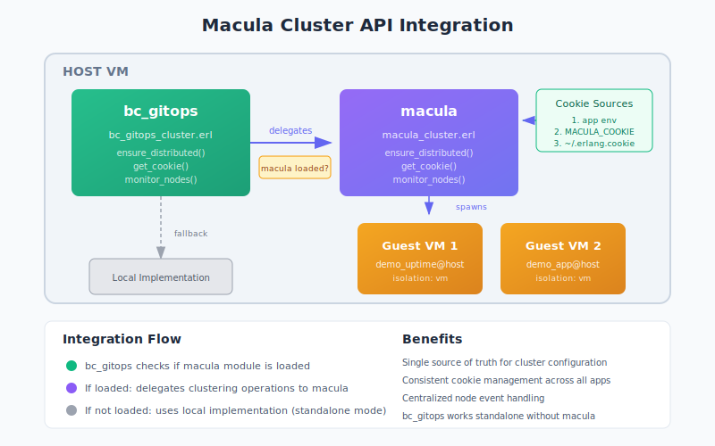

# Cluster API Guide

This guide explains the Macula Cluster API, which provides cluster infrastructure functions for applications running on the Macula platform.

## Overview

The Cluster API (`macula_cluster.erl`) provides a standardized interface for:

- **Distribution Management** - Starting and verifying Erlang distribution
- **Cookie Management** - Resolving, setting, and persisting cluster cookies
- **Node Monitoring** - Subscribing to node join/leave events



## Why This API Exists

When applications like [bc_gitops](https://github.com/beam-campus/bc-gitops) run on the Macula platform, they can delegate cluster infrastructure operations to Macula. This provides:

1. **Single Source of Truth** - Macula owns cluster configuration
2. **Consistent Cookie Management** - All applications use the same cookie resolution
3. **Centralized Node Monitoring** - Coordinated handling of node events
4. **Standalone Fallback** - Applications work without Macula by using their own implementations

## API Reference

### Distribution

#### `macula:ensure_distributed/0`

Ensures the node is running in distributed mode.

```erlang
ok = macula:ensure_distributed().
```

If the node is already distributed, returns `ok` immediately. Otherwise, starts distribution with a generated node name in the format `macula_host@hostname`.

**Returns:**
- `ok` - Node is now distributed
- `{error, {distribution_failed, Reason}}` - Failed to start distribution

### Cookie Management

#### `macula:get_cookie/0`

Gets the Erlang cookie for the cluster.

```erlang
Cookie = macula:get_cookie().
%% => 'A1B2C3D4E5F6G7H8I9J0...'
```

Resolves the cookie from various sources in priority order:

1. **Application env**: `{macula, [{cookie, CookieValue}]}`
2. **Environment variable**: `MACULA_COOKIE` or `RELEASE_COOKIE`
3. **Cookie file**: `~/.erlang.cookie`
4. **Auto-generated**: Creates and persists a new cookie

**Returns:** `atom()` - The cluster cookie

#### `macula:set_cookie/1`

Sets the Erlang cookie for this node and persists it.

```erlang
ok = macula:set_cookie(my_secret_cookie).
ok = macula:set_cookie(<<"my_secret_cookie">>).
```

**Parameters:**
- `Cookie :: atom() | binary()` - The cookie to set

**Returns:** `ok`

### Node Monitoring

#### `macula:monitor_nodes/0`

Subscribes the calling process to node up/down events.

```erlang
ok = macula:monitor_nodes().

%% The process now receives:
receive
    {nodeup, Node} ->
        io:format("Node joined: ~p~n", [Node]);
    {nodedown, Node} ->
        io:format("Node left: ~p~n", [Node])
end.
```

**Returns:** `ok`

#### `macula:unmonitor_nodes/0`

Unsubscribes from node up/down events.

```erlang
ok = macula:unmonitor_nodes().
```

**Returns:** `ok`

## Integration with bc_gitops

bc_gitops uses an optional dependency pattern to delegate to Macula when available:

```erlang
%% In bc_gitops_cluster.erl
ensure_distributed() ->
    case macula_exports(ensure_distributed, 0) of
        true ->
            %% Macula is available - delegate
            apply(macula, ensure_distributed, []);
        false ->
            %% Macula not available - use local implementation
            do_ensure_distributed()
    end.

macula_exports(Function, Arity) ->
    macula_available() andalso
    erlang:function_exported(macula, Function, Arity).

macula_available() ->
    case code:ensure_loaded(macula) of
        {module, macula} -> true;
        {error, _} -> false
    end.
```

This pattern ensures:
- bc_gitops works standalone (without Macula)
- When Macula is present, it owns cluster infrastructure
- No compile-time dependency on Macula

## Cookie Resolution Flow

```
┌─────────────────────────────────────────────────────────────────┐
│                    macula:get_cookie/0                          │
└─────────────────────────────────────────────────────────────────┘
                              │
                              ▼
              ┌───────────────────────────────┐
              │  1. Check application env     │
              │     {macula, [{cookie, X}]}   │
              └───────────────────────────────┘
                              │
                    Found?    │    Not found
              ┌───────────────┴───────────────┐
              ▼                               ▼
         Return cookie        ┌───────────────────────────────┐
                              │  2. Check environment vars    │
                              │     MACULA_COOKIE             │
                              │     RELEASE_COOKIE            │
                              │     ERLANG_COOKIE             │
                              └───────────────────────────────┘
                                              │
                                    Found?    │    Not found
                              ┌───────────────┴───────────────┐
                              ▼                               ▼
                         Return cookie        ┌───────────────────────────────┐
                                              │  3. Read ~/.erlang.cookie     │
                                              └───────────────────────────────┘
                                                              │
                                                    Found?    │    Not found
                                              ┌───────────────┴───────────────┐
                                              ▼                               ▼
                                         Return cookie        ┌───────────────────────────────┐
                                                              │  4. Generate new cookie       │
                                                              │     - crypto:strong_rand_bytes│
                                                              │     - Persist to file         │
                                                              └───────────────────────────────┘
                                                                              │
                                                                              ▼
                                                                         Return cookie
```

## Configuration

### Application Environment

```erlang
%% sys.config
[
    {macula, [
        {cookie, 'my_cluster_cookie'}
    ]}
].
```

### Environment Variables

```bash
# Primary: Macula-specific
export MACULA_COOKIE="my_cluster_cookie"

# Secondary: Standard Erlang/OTP
export RELEASE_COOKIE="my_cluster_cookie"
export ERLANG_COOKIE="my_cluster_cookie"
```

### Cookie File

The standard Erlang cookie file at `~/.erlang.cookie` is used as a fallback. If no cookie is found through other methods, a new cookie is generated and persisted here.

## Use Cases

### Isolated VM Deployment (bc_gitops)

When bc_gitops spawns isolated VMs for guest applications, it uses the Cluster API to:

1. Ensure the host is distributed before spawning guests
2. Get the cookie to pass to spawned VMs
3. Monitor node events to track guest VM health

```erlang
%% In bc_gitops_reconciler.erl
init(Config) ->
    %% Ensure we're distributed for isolated VM support
    ok = bc_gitops_cluster:ensure_distributed(),

    %% Subscribe to node events
    _ = bc_gitops_cluster:monitor_nodes(),

    %% ... rest of init
```

### Multi-Node Applications

Applications that need to coordinate across nodes can use the monitoring API:

```erlang
-module(my_coordinator).
-behaviour(gen_server).

init(_) ->
    ok = macula:monitor_nodes(),
    {ok, #state{nodes = []}}.

handle_info({nodeup, Node}, State) ->
    NewNodes = [Node | State#state.nodes],
    redistribute_work(NewNodes),
    {noreply, State#state{nodes = NewNodes}};

handle_info({nodedown, Node}, State) ->
    NewNodes = lists:delete(Node, State#state.nodes),
    redistribute_work(NewNodes),
    {noreply, State#state{nodes = NewNodes}}.
```

## Testing

The cluster API is covered by 19 unit tests in `macula_cluster_tests.erl`:

```bash
rebar3 eunit --module=macula_cluster_tests
```

Tests cover:
- Distribution state detection
- Cookie resolution from all sources
- Cookie persistence
- Node monitoring subscriptions
- API delegation from `macula.erl`

## Related Documentation

- [bc_gitops Isolated VM Deployment](https://github.com/beam-campus/bc-gitops/blob/main/guides/isolated_vm_deployment.md)
- [Macula Distribution System](../developer/distribution.md)
- [Erlang Distribution Protocol](https://www.erlang.org/doc/reference_manual/distributed.html)
