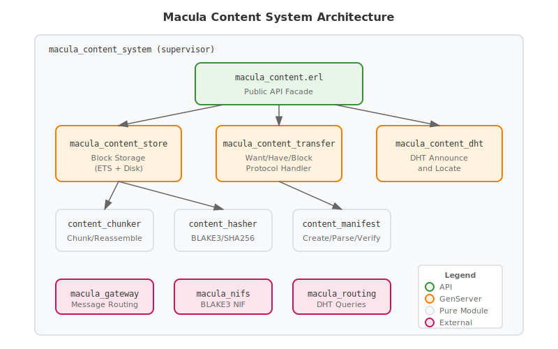
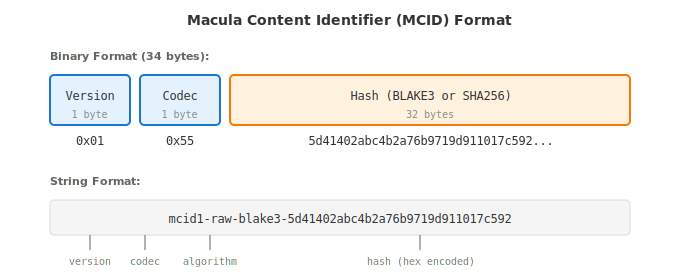
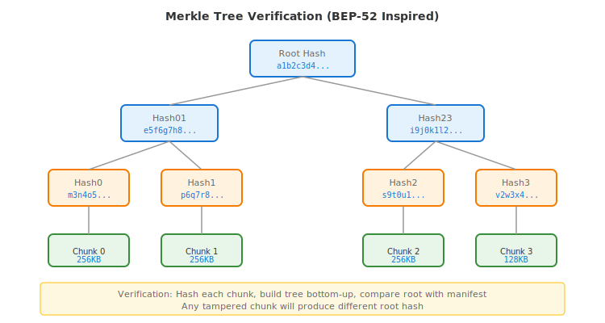
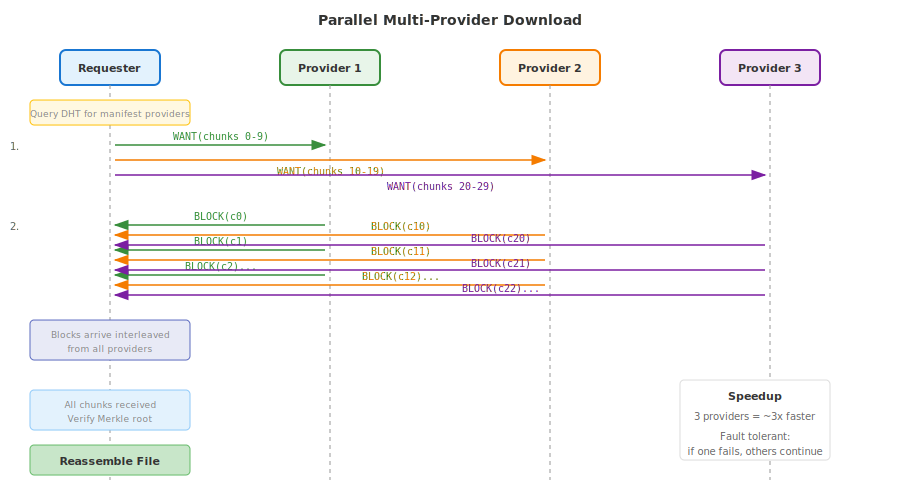
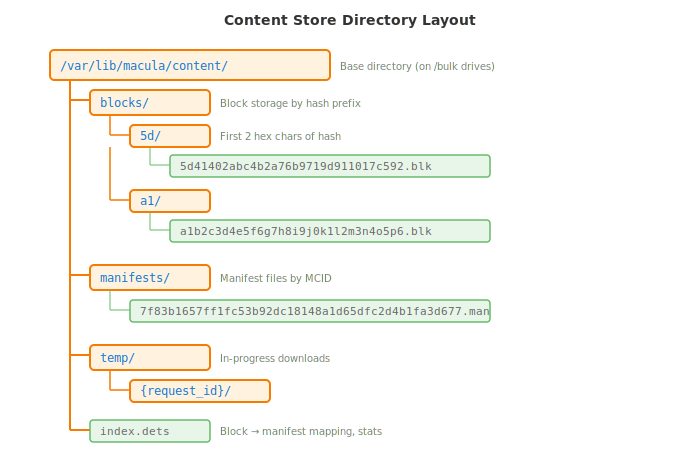

# Content Transfer System Guide

## Overview

The Macula Content System provides **native BEAM content-addressed transfer** for P2P distribution of OTP releases and artifacts across the mesh. It enables nodes to publish, discover, and fetch content without external dependencies like IPFS or container registries.

**Key Features:**
- Content-addressed storage (same content = same identifier everywhere)
- Merkle tree verification for integrity
- Parallel download from multiple providers
- NAT-friendly (uses existing Macula mesh transport)
- Hybrid distribution: hex.pm for public packages, mesh for private/local



## Why Native BEAM?

The Macula ecosystem needs a way to distribute artifacts (OTP releases, packages) without:
- Container registries (OCI/Docker) - heavy, infrastructure-dependent
- External protocols (IPFS, BitTorrent) - duplicate NAT traversal
- Centralized package hosts - single point of failure

A native BEAM solution leverages the existing mesh infrastructure, including NAT traversal (v0.12.0+), DHT-based discovery, and direct P2P connections.

## Protocol Design

The content system borrows proven patterns from established protocols:

| Source Protocol | What We Borrow |
|-----------------|----------------|
| [IPFS Bitswap](https://specs.ipfs.tech/bitswap-protocol/) | Want/Have/Block exchange pattern |
| [BitTorrent BEP-52](https://www.bittorrent.org/beps/bep_0052.html) | Merkle tree piece verification |
| [BLAKE3](https://github.com/BLAKE3-team/BLAKE3-specs) | Tree-based hashing for parallel/streaming |
| IPFS CID | Content identifier structure |

---

## Content Identifier (MCID)

Every piece of content in Macula is identified by a **Macula Content Identifier (MCID)** - a 34-byte self-describing hash that uniquely identifies content regardless of where it's stored.



### Binary Format (34 bytes)

```
┌───────────┬───────────┬────────────────────────────┐
│  Version  │   Codec   │         Hash               │
│  1 byte   │  1 byte   │        32 bytes            │
│   0x01    │   0x55    │  BLAKE3 or SHA256          │
└───────────┴───────────┴────────────────────────────┘
```

### String Representation

For human-readable contexts, MCIDs are encoded as:

```
mcid1-raw-blake3-5d41402abc4b2a76b9719d911017c592
mcid1-raw-sha256-e3b0c44298fc1c149afbf4c8996fb924
```

### Erlang Type

```erlang
-type mcid() :: <<_:272>>.  %% 34 bytes: 1 + 1 + 32

-record(mcid, {
    version = 1 :: pos_integer(),
    codec = raw :: raw | manifest,
    hash_type :: blake3 | sha256,
    hash :: <<_:256>>  %% 32 bytes
}).
```

---

## Merkle Tree Verification

Content integrity is verified using a **Merkle tree** structure inspired by BitTorrent BEP-52. Each chunk is hashed, then pairs of hashes are combined recursively until a single root hash remains.



### Verification Process

1. **Hash each chunk** - Compute BLAKE3/SHA256 hash of each 256KB chunk
2. **Build tree bottom-up** - Combine pairs of hashes until root
3. **Compare with manifest** - Root hash must match manifest's `root_hash`

Any tampered chunk will produce a different root hash, making tampering detectable.

### Why This Matters

- **Chunk-level verification** - Bad chunks can be identified and re-requested
- **Parallel verification** - Can verify chunks as they arrive
- **Incremental downloads** - Partial downloads are verifiable

---

## Transfer Flow

### Single Provider Download

When fetching content from a single provider, the flow is straightforward:


**Steps:**

1. **Manifest Request** - Requester sends `CONTENT_MANIFEST_REQ(mcid)` to provider
2. **Manifest Response** - Provider returns the manifest with chunk list
3. **Verification** - Requester verifies signature (if present), checks local store
4. **Want List** - Requester sends `CONTENT_WANT` for missing chunks
5. **Block Transfer** - Provider sends blocks, requester verifies each hash
6. **Reassembly** - When all chunks received, verify Merkle root and reassemble

### Parallel Multi-Provider Download

The real power comes from downloading chunks from **multiple providers simultaneously**:



**Advantages:**

- **~3x speedup** with 3 providers (linear scaling)
- **Fault tolerant** - if one provider fails, others continue
- **Load distribution** - no single provider bottleneck

**How It Works:**

1. Query DHT for all providers of the manifest MCID
2. Divide chunk list among available providers
3. Send `CONTENT_WANT` to each provider for their assigned chunks
4. Receive blocks interleaved from all providers
5. Reassemble when all chunks received

---

## Local Storage

Content is stored locally in a structured directory layout optimized for fast lookup and efficient garbage collection.



### Directory Structure

```
/var/lib/macula/content/           # Base directory (on /bulk drives)
├── blocks/
│   ├── 5d/                        # First 2 hex chars of hash (prefix sharding)
│   │   └── 5d41402abc4b2a76b9719d911017c592.blk
│   ├── a1/
│   │   └── a1b2c3d4e5f6...blk
│   └── ...
├── manifests/
│   ├── 7f83b1657ff1fc53b92dc18148a1d65d...man
│   └── ...
├── temp/                          # In-progress downloads
│   └── {request_id}/
│       ├── manifest.tmp
│       └── chunks/
└── index.dets                     # Block → manifest mapping, stats
```

### Storage Notes

- **Prefix sharding** - Blocks are stored in subdirectories by hash prefix (first 2 hex chars) to avoid filesystem limits on files per directory
- **Separate manifest storage** - Manifests are small and frequently accessed, stored separately
- **Temp directory** - Partial downloads are kept separate until complete and verified
- **Index** - DETS file tracks which blocks belong to which manifests for garbage collection

---

## Wire Protocol

The content system uses message types `0x70-0x7F` in the Macula protocol:

| Type | ID | Direction | Purpose |
|------|-----|-----------|---------|
| `CONTENT_WANT` | `0x70` | Request | Request specific blocks by MCID |
| `CONTENT_HAVE` | `0x71` | Response | Announce available blocks |
| `CONTENT_BLOCK` | `0x72` | Response | Send block data |
| `CONTENT_MANIFEST_REQ` | `0x73` | Request | Request manifest by MCID |
| `CONTENT_MANIFEST_RES` | `0x74` | Response | Return manifest data |
| `CONTENT_CANCEL` | `0x75` | Request | Cancel pending wants |

### Message Examples

**CONTENT_WANT (0x70):**
```erlang
#{
    <<"request_id">> => <<"req-123">>,
    <<"wants">> => [
        #{<<"mcid">> => <<...>>, <<"priority">> => 1},
        #{<<"mcid">> => <<...>>, <<"priority">> => 2}
    ],
    <<"max_blocks">> => 10,
    <<"from_node">> => <<"node-abc">>
}
```

**CONTENT_BLOCK (0x72):**
```erlang
#{
    <<"request_id">> => <<"req-123">>,
    <<"mcid">> => <<...>>,
    <<"data">> => <<...raw binary data...>>,
    <<"from_node">> => <<"node-xyz">>
}
```

---

## Public API

The content system exposes a simple, high-level API through the `macula_content` module.

### Publishing Content

```erlang
%% Publish a file - chunks it, creates manifest, stores locally, announces to DHT
{ok, MCID} = macula_content:publish("/path/to/my_app-1.0.0.tar.gz").

%% Publish with options
{ok, MCID} = macula_content:publish("/path/to/release.tar.gz", #{
    name => <<"my_app-1.0.0">>,
    chunk_size => 524288,           %% 512KB chunks
    hash_algorithm => blake3,
    sign => true,                   %% Sign with node key
    announce => true                %% Announce to DHT
}).

%% Remove content from local store and DHT
ok = macula_content:unpublish(MCID).
```

### Fetching Content

```erlang
%% Fetch by MCID - locates providers, downloads, verifies, reassembles
{ok, FilePath} = macula_content:fetch(MCID).

%% Fetch with options
{ok, FilePath} = macula_content:fetch(MCID, #{
    output_dir => "/tmp/downloads",
    parallel => 4,                  %% Max concurrent providers
    verify => true,                 %% Verify Merkle root
    timeout => 300000               %% 5 minute timeout
}).

%% Async fetch with progress callback
Callback = fun
    ({started, TotalSize}) -> io:format("Starting download: ~p bytes~n", [TotalSize]);
    ({chunk, Index, Total}) -> io:format("Chunk ~p/~p~n", [Index, Total]);
    ({completed, Path}) -> io:format("Done: ~s~n", [Path]);
    ({error, Reason}) -> io:format("Error: ~p~n", [Reason])
end,
{ok, RequestId} = macula_content:fetch_async(MCID, Callback).
```

### Querying Content

```erlang
%% Locate providers in the mesh
{ok, NodeIds} = macula_content:locate(MCID).

%% Get manifest (local or remote)
{ok, Manifest} = macula_content:stat(MCID).

%% List locally stored content
LocalMCIDs = macula_content:list_local().

%% Check if content is available locally
true = macula_content:is_local(MCID).
```

---

## Hash Algorithm

### Primary: BLAKE3

BLAKE3 is the default hash algorithm, chosen for:

- **Speed** - 2-4x faster than SHA256 in software
- **Tree mode** - Native support for parallel hashing
- **Streaming** - Can verify chunks as they arrive
- **Modern security** - Based on ChaCha cipher

### Fallback: SHA256

SHA256 is available for compatibility:

- Hardware acceleration on modern CPUs (Intel SHA-NI)
- Wider ecosystem support
- Proven security record

### Implementation

```erlang
%% Hash data
Hash = macula_content_hasher:hash(blake3, BinaryData).

%% Hash a file (memory efficient)
{ok, Hash} = macula_content_hasher:hash_file(sha256, "/path/to/file").

%% Verify data against expected hash
true = macula_content_hasher:verify(blake3, Data, ExpectedHash).
```

**NIF Optimization:** For maximum performance, BLAKE3 hashing is accelerated via Rust NIFs in `macula-nifs/`. The pure Erlang fallback is used when NIFs are unavailable.

---

## Configuration

### Environment Variables

| Variable | Default | Description |
|----------|---------|-------------|
| `MACULA_CONTENT_ENABLED` | `true` | Enable content system |
| `MACULA_CONTENT_STORE_PATH` | `/var/lib/macula/content` | Block storage directory |
| `MACULA_CONTENT_CHUNK_SIZE` | `262144` | Default chunk size (256KB) |
| `MACULA_CONTENT_HASH_ALGORITHM` | `blake3` | Default hash algorithm |
| `MACULA_CONTENT_MAX_PARALLEL` | `4` | Max parallel providers |
| `MACULA_CONTENT_GC_INTERVAL` | `3600` | Garbage collection interval (seconds) |

### Application Config

```erlang
{macula, [
    {content_enabled, true},
    {content_store_path, "/var/lib/macula/content"},
    {content_chunk_size, 262144},
    {content_hash_algorithm, blake3},
    {content_max_parallel, 4},
    {content_gc_interval, 3600}
]}.
```

---

## Integration Examples

### bc-gitops: Fetching Releases from Mesh

```erlang
%% In bc_gitops_runtime.erl
fetch_from_mesh(#app_spec{source = #{type := mesh, mcid := MCID}}) ->
    case macula_content:fetch(MCID, #{output_dir => releases_dir()}) of
        {ok, TarPath} ->
            extract_release(TarPath);
        {error, Reason} ->
            {error, {fetch_failed, Reason}}
    end.
```

### macula-console: Publishing to Marketplace

```elixir
defmodule MaculaReleases do
  def publish(release_path) do
    case :macula_content.publish(release_path, %{sign: true, announce: true}) do
      {:ok, mcid} -> {:ok, mcid}
      {:error, reason} -> {:error, reason}
    end
  end

  def fetch(mcid, opts \\ %{}) do
    :macula_content.fetch(mcid, opts)
  end
end
```

---

## Hybrid Distribution Model

The content system enables a **hybrid distribution** approach:

| Content Type | Distribution Method | Discovery |
|--------------|---------------------|-----------|
| Public packages | hex.pm | Global registry |
| Private packages | Macula mesh | DHT |
| Local dev builds | Macula mesh | Local DHT |
| Organization releases | Macula mesh | Organization DHT |

This allows:
- **Public packages** to use the established hex.pm ecosystem
- **Private packages** to stay within organizational boundaries
- **Local development** to share builds without external infrastructure
- **Edge deployments** to work offline with cached content

---

## Best Practices

### For Publishers

1. **Sign releases** - Always use `sign => true` for production releases
2. **Choose chunk size wisely** - 256KB is good for most cases; larger for big files
3. **Clean up** - Use `unpublish/1` when retiring old versions

### For Consumers

1. **Verify by default** - Keep `verify => true` (default)
2. **Use parallel downloads** - Set `parallel => 4` or higher for large files
3. **Handle errors gracefully** - Providers may go offline mid-transfer

### For Operations

1. **Monitor storage** - Set up alerts for content store disk usage
2. **Configure GC** - Adjust `content_gc_interval` based on publish frequency
3. **Use `/bulk` drives** - Store content on HDD storage, not NVMe/SSD

---

## References

- [IPFS Bitswap Specification](https://specs.ipfs.tech/bitswap-protocol/)
- [BitTorrent BEP-52 - Merkle Tree](https://www.bittorrent.org/beps/bep_0052.html)
- [BLAKE3 Specification](https://github.com/BLAKE3-team/BLAKE3-specs)
- [Content Addressable aRchive (CAR)](https://ipld.io/specs/transport/car/)
- [Macula NAT Traversal Guide](NAT_TRAVERSAL_DEVELOPER_GUIDE.md)
- [Macula DHT Guide](DHT_GUIDE.md)
