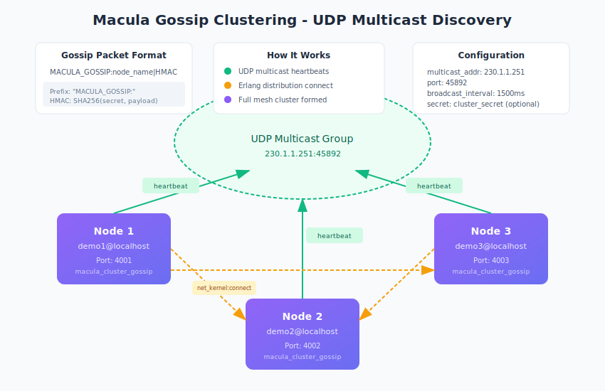

# Gossip-Based Clustering Guide

This guide explains Macula's UDP multicast gossip clustering, which enables zero-configuration cluster formation on local networks.

## Overview

The `macula_cluster_gossip` module provides automatic cluster discovery using UDP multicast, similar to libcluster's Gossip strategy but implemented natively in Erlang as part of the macula library.



## How It Works

1. **Join Multicast Group**: Each node joins the UDP multicast group (default: `230.1.1.251:45892`)
2. **Broadcast Heartbeats**: Nodes periodically broadcast their Erlang node name
3. **Discover Peers**: When a heartbeat is received from an unknown node, it's added to discovered set
4. **Connect via Distribution**: Newly discovered nodes are connected using `net_kernel:connect_node/1`
5. **Full Mesh**: All nodes eventually connect to form a full mesh cluster

## Quick Start

### Elixir (Phoenix Application)

```elixir
# In application.ex
def start(_type, _args) do
  # Start gossip clustering
  :macula_cluster.start_cluster(%{strategy: :gossip})

  children = [
    # ... your supervision tree
  ]

  Supervisor.start_link(children, strategy: :one_for_one)
end
```

### Erlang

```erlang
%% Start with defaults
{ok, _Pid} = macula_cluster_gossip:start_link(#{}).

%% Or with custom configuration
{ok, _Pid} = macula_cluster_gossip:start_link(#{
    multicast_addr => {230, 1, 1, 251},
    port => 45892,
    broadcast_interval => 1500,
    secret => <<"my_cluster_secret">>
}).
```

### Via `macula_cluster` API

```erlang
%% Recommended: Use the macula_cluster facade
ok = macula_cluster:start_cluster(#{strategy => gossip}).

%% With options
ok = macula_cluster:start_cluster(#{
    strategy => gossip,
    secret => <<"my_cluster_secret">>
}).
```

## Configuration

### Options

| Option | Type | Default | Description |
|--------|------|---------|-------------|
| `multicast_addr` | `{A,B,C,D}` | `{230,1,1,251}` | Multicast group address |
| `port` | `integer()` | `45892` | UDP port for gossip |
| `broadcast_interval` | `integer()` | `1500` | Milliseconds between heartbeats |
| `multicast_ttl` | `integer()` | `1` | Time-to-live (1 = same subnet) |
| `secret` | `binary()` | `undefined` | Shared secret for HMAC authentication |
| `callback` | `pid() \| {M,F}` | `undefined` | Callback for cluster events |

### Environment Variables

```bash
# Multicast configuration
MACULA_GOSSIP_ADDR=230.1.1.251
MACULA_GOSSIP_PORT=45892
MACULA_GOSSIP_SECRET=my_cluster_secret

# Cluster strategy selection
CLUSTER_STRATEGY=gossip
CLUSTER_SECRET=my_cluster_secret
```

### Docker Compose Example

```yaml
services:
  node1:
    image: my-app:latest
    network_mode: host  # Required for UDP multicast
    environment:
      - RELEASE_NODE=node1@localhost
      - RELEASE_COOKIE=my_secret_cookie
      - CLUSTER_STRATEGY=gossip
      - CLUSTER_SECRET=demo_secret

  node2:
    image: my-app:latest
    network_mode: host
    environment:
      - RELEASE_NODE=node2@localhost
      - RELEASE_COOKIE=my_secret_cookie
      - CLUSTER_STRATEGY=gossip
      - CLUSTER_SECRET=demo_secret
```

## Security

### HMAC Authentication

When a `secret` is configured, all gossip packets include an HMAC signature:

```
MACULA_GOSSIP:node_name|<HMAC-SHA256>
```

- **Without secret**: Nodes accept any valid-looking gossip packet
- **With secret**: Nodes verify HMAC before accepting the packet

```erlang
%% Enable authentication
ok = macula_cluster:start_cluster(#{
    strategy => gossip,
    secret => <<"production_cluster_key_2026">>
}).
```

### Best Practices

1. **Always use a secret in production** - Prevents unauthorized nodes from joining
2. **Rotate secrets periodically** - Coordinate secret rotation across all nodes
3. **Use network segmentation** - Limit multicast scope with VLANs
4. **Set TTL appropriately** - `multicast_ttl => 1` limits to same subnet

## API Reference

### Query Functions

```erlang
%% Get all discovered nodes (may not be connected yet)
Discovered = macula_cluster_gossip:get_discovered().
%% => [demo2@localhost, demo3@localhost]

%% Get connected nodes
Connected = macula_cluster_gossip:get_connected().
%% => [demo2@localhost, demo3@localhost]

%% Force immediate broadcast (useful for testing)
ok = macula_cluster_gossip:broadcast_now().
```

### Cluster Events

Register a callback to receive cluster events:

```erlang
%% Using a PID
{ok, _} = macula_cluster_gossip:start_link(#{callback => self()}).

%% Process receives:
receive
    {macula_cluster, nodeup, Node} ->
        io:format("Node joined: ~p~n", [Node]);
    {macula_cluster, nodedown, Node} ->
        io:format("Node left: ~p~n", [Node])
end.

%% Using module/function callback
{ok, _} = macula_cluster_gossip:start_link(#{
    callback => {my_module, handle_cluster_event}
}).
```

## Network Requirements

### Firewall Rules

```bash
# Allow UDP multicast traffic
iptables -A INPUT -p udp --dport 45892 -j ACCEPT
iptables -A OUTPUT -p udp --dport 45892 -j ACCEPT

# For Erlang distribution (EPMD and distribution ports)
iptables -A INPUT -p tcp --dport 4369 -j ACCEPT
iptables -A INPUT -p tcp --dport 9100:9200 -j ACCEPT
```

### Docker Networking

**Option 1: Host Networking (Recommended for development)**
```yaml
network_mode: host
```

**Option 2: Macvlan (Production)**
```yaml
networks:
  macvlan_net:
    driver: macvlan
    driver_opts:
      parent: eth0
    ipam:
      config:
        - subnet: 192.168.1.0/24
```

### Kubernetes

For Kubernetes deployments, use a sidecar or DaemonSet approach with host networking for the gossip component, or consider the `static` strategy with DNS-based discovery instead.

## Troubleshooting

### Nodes Not Discovering Each Other

1. **Check multicast support**:
   ```bash
   # Test multicast
   ping -c 3 230.1.1.251
   ```

2. **Verify UDP port is open**:
   ```bash
   ss -ulnp | grep 45892
   ```

3. **Check Docker networking**:
   ```bash
   # Must use host networking for multicast
   docker inspect <container> | grep NetworkMode
   ```

4. **Verify cookie matches**:
   ```erlang
   erlang:get_cookie().
   ```

### Authentication Failures

If nodes have mismatched secrets, you'll see log messages like:
```
[warning] [macula_cluster_gossip] Invalid HMAC from <IP> (authentication failed)
```

**Solution**: Ensure all nodes use the same `CLUSTER_SECRET` environment variable.

### High CPU Usage

If `broadcast_interval` is too low, increase it:
```erlang
{ok, _} = macula_cluster_gossip:start_link(#{
    broadcast_interval => 5000  % 5 seconds instead of default 1.5
}).
```

## Comparison with Other Strategies

| Strategy | Discovery | Configuration | Network | Use Case |
|----------|-----------|---------------|---------|----------|
| **gossip** | Automatic | Zero-config | LAN multicast | Development, same-subnet production |
| **static** | Manual | Node list required | Any | Known node sets, cross-subnet |
| **mdns** | Automatic | Zero-config | LAN mDNS | macOS/Linux local development |
| **dns** | Automatic | DNS SRV records | Any | Kubernetes, cloud deployments |

## Related Documentation

- [Cluster API Guide](./CLUSTER_API_GUIDE.md) - Core clustering API
- [Troubleshooting Guide](../operator/TROUBLESHOOTING_GUIDE.md) - Common issues

## Testing

```bash
# Run gossip clustering tests
rebar3 eunit --module=macula_cluster_gossip_tests

# Run full cluster test suite
rebar3 eunit --dir=test/macula_dist_system
```

Test coverage includes:
- Heartbeat generation and parsing
- HMAC authentication
- Node discovery and connection
- Multicast socket management
- Error handling
