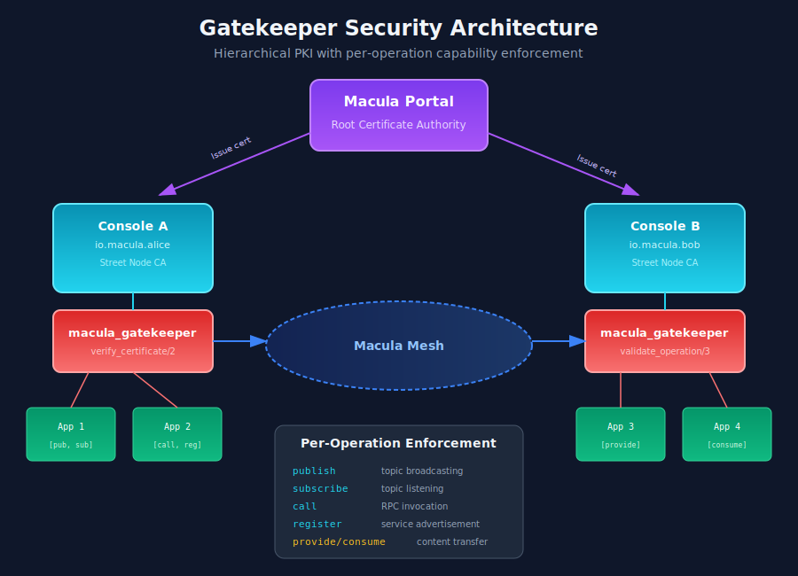
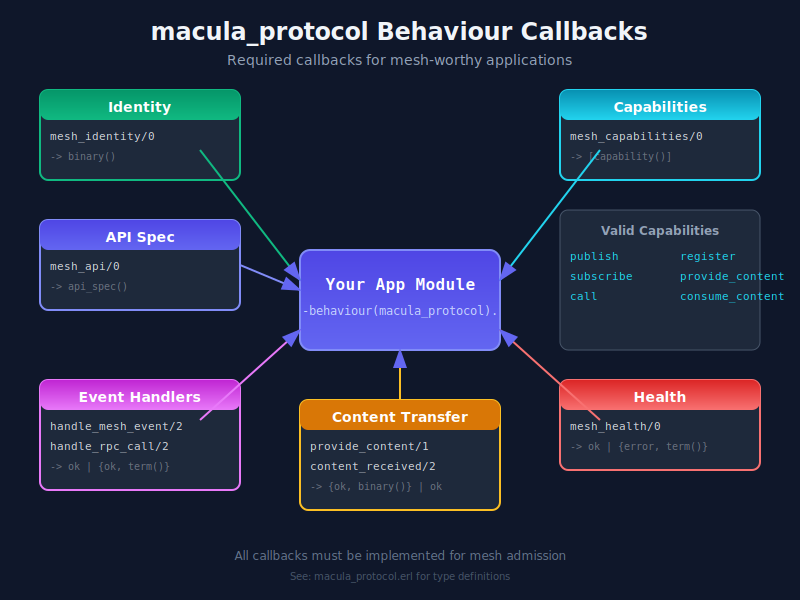
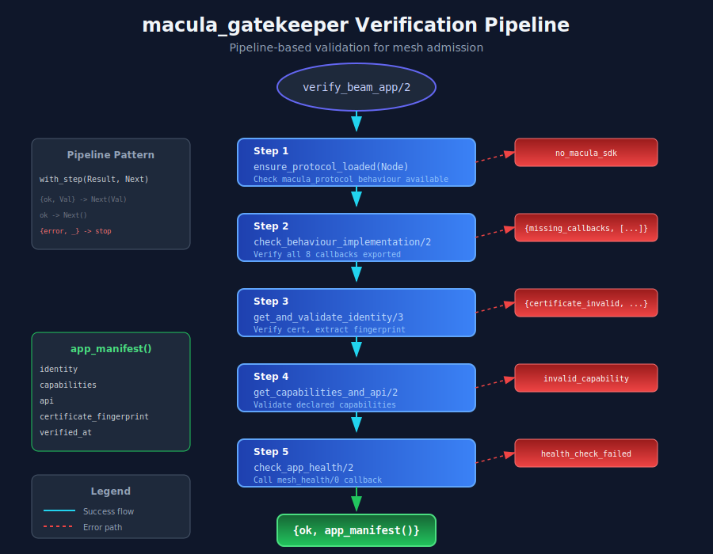

# Macula Protocol and Gatekeeper Guide

This guide covers the `macula_protocol` behaviour and `macula_gatekeeper` module, which together ensure that only properly implemented applications can participate in the Macula mesh network.

## Overview

The Macula mesh uses a **gatekeeper pattern** to validate applications before allowing them to join:

1. **macula_protocol** - A behaviour that defines the contract mesh-worthy apps must implement
2. **macula_gatekeeper** - A module that validates applications implement the protocol correctly



## Why Gatekeeping?

Without gatekeeping, any application could join the mesh and potentially:
- Consume resources without providing value
- Send malformed messages that break other nodes
- Claim capabilities they don't actually implement
- Impersonate other applications

The gatekeeper ensures applications:
- Implement all required callbacks
- Present valid certificates
- Declare capabilities truthfully
- Can handle mesh operations correctly

## The macula_protocol Behaviour

### Required Callbacks

Every mesh application must implement these 8 callbacks:



#### Identity and Configuration

```erlang
%% Returns the application's unique mesh identity
-callback mesh_identity() -> identity().
%% Example: <<"io.macula.alice.weather-app">>

%% Returns the list of capabilities this app requires
-callback mesh_capabilities() -> [capability()].
%% Example: [publish, subscribe, call]

%% Returns the API specification (topics, procedures, content types)
-callback mesh_api() -> api_spec().
%% Example: #{
%%     topics => [<<"weather.updates">>, <<"weather.alerts">>],
%%     procedures => [<<"weather.getForecast">>],
%%     content_types => []
%% }
```

#### Message Handlers

```erlang
%% Handles incoming pub/sub events
-callback handle_mesh_event(Topic :: binary(), Payload :: term()) ->
    ok | {error, term()}.

%% Handles incoming RPC calls
-callback handle_rpc_call(Procedure :: binary(), Args :: list()) ->
    {ok, term()} | {error, term()}.
```

#### Content Transfer

```erlang
%% Provides content when requested by MCID (Macula Content ID)
-callback provide_content(ContentId :: binary()) ->
    {ok, binary()} | {error, term()}.

%% Handles received content
-callback content_received(ContentId :: binary(), Content :: binary()) ->
    ok | {error, term()}.
```

#### Health

```erlang
%% Returns health status (called periodically by gatekeeper)
-callback mesh_health() -> ok | {error, term()}.
```

### Valid Capabilities

Applications must declare which capabilities they need:

| Capability | Description |
|------------|-------------|
| `publish` | Can publish to topics |
| `subscribe` | Can subscribe to topics |
| `call` | Can invoke RPC procedures |
| `register` | Can register RPC procedures |
| `provide_content` | Can serve content via MCID |
| `consume_content` | Can request content via MCID |

### Example Implementation

```erlang
-module(my_weather_app).
-behaviour(macula_protocol).

%% Protocol callbacks
-export([
    mesh_identity/0,
    mesh_capabilities/0,
    mesh_api/0,
    handle_mesh_event/2,
    handle_rpc_call/2,
    provide_content/1,
    content_received/2,
    mesh_health/0
]).

%%====================================================================
%% Identity & Configuration
%%====================================================================

mesh_identity() ->
    <<"io.macula.alice.weather-app">>.

mesh_capabilities() ->
    [publish, subscribe, call, register].

mesh_api() ->
    #{
        topics => [<<"weather.updates">>, <<"weather.alerts">>],
        procedures => [<<"weather.getForecast">>, <<"weather.getHistory">>],
        content_types => []
    }.

%%====================================================================
%% Event Handlers
%%====================================================================

handle_mesh_event(<<"weather.alerts">>, #{<<"severity">> := Sev} = Payload) ->
    logger:info("Weather alert received: severity=~p", [Sev]),
    process_alert(Payload),
    ok;
handle_mesh_event(Topic, _Payload) ->
    logger:debug("Ignoring event on ~s", [Topic]),
    ok.

handle_rpc_call(<<"weather.getForecast">>, [Location]) ->
    case fetch_forecast(Location) of
        {ok, Forecast} -> {ok, Forecast};
        {error, Reason} -> {error, Reason}
    end;
handle_rpc_call(<<"weather.getHistory">>, [Location, Days]) ->
    case fetch_history(Location, Days) of
        {ok, History} -> {ok, History};
        {error, Reason} -> {error, Reason}
    end;
handle_rpc_call(Procedure, _Args) ->
    {error, {unknown_procedure, Procedure}}.

%%====================================================================
%% Content Transfer
%%====================================================================

provide_content(_ContentId) ->
    %% This app doesn't provide content
    {error, not_implemented}.

content_received(_ContentId, _Content) ->
    %% This app doesn't consume content
    ok.

%%====================================================================
%% Health
%%====================================================================

mesh_health() ->
    %% Check internal state is healthy
    case check_database_connection() of
        ok -> ok;
        {error, Reason} -> {error, {database_unavailable, Reason}}
    end.

%%====================================================================
%% Internal Functions
%%====================================================================

process_alert(Payload) ->
    %% Handle alert...
    ok.

fetch_forecast(Location) ->
    %% Fetch forecast from database...
    {ok, #{<<"temperature">> => 22, <<"conditions">> => <<"sunny">>}}.

fetch_history(Location, Days) ->
    %% Fetch history from database...
    {ok, []}.

check_database_connection() ->
    ok.
```

## The macula_gatekeeper Module

The gatekeeper validates applications using a **pipeline pattern** where each step must pass before proceeding to the next.

### Verification Pipeline



1. **Protocol Loaded** - Ensure `macula_protocol` module is available on the target node
2. **Behaviour Check** - Verify all 8 callbacks are exported
3. **Identity + Certificate** - Validate certificate and extract fingerprint
4. **Capabilities + API** - Validate declared capabilities and API spec
5. **Health Check** - Call `mesh_health/0` to verify app is functioning

### API

#### verify_beam_app/2,3

Validates a BEAM (Erlang/Elixir) application:

```erlang
%% Verify on local node
{ok, Manifest} = macula_gatekeeper:verify_beam_app(my_weather_app, CertPem).

%% Verify on remote node
{ok, Manifest} = macula_gatekeeper:verify_beam_app(my_weather_app, CertPem, 'node@host').
```

Returns `{ok, app_manifest()}` on success:

```erlang
#{
    identity => <<"io.macula.alice.weather-app">>,
    capabilities => [publish, subscribe, call, register],
    api => #{topics => [...], procedures => [...], content_types => []},
    certificate_fingerprint => <<"A1B2C3D4...">>,
    verified_at => {{2026,1,23},{12,0,0}}
}
```

Or `{error, Reason}` on failure:

| Error | Cause |
|-------|-------|
| `no_macula_sdk` | macula_protocol not available |
| `{module_not_found, Module}` | Application module not loaded |
| `{missing_callbacks, [...]}` | Not all callbacks exported |
| `{certificate_invalid, Reason}` | Certificate parsing failed |
| `invalid_capability` | Unknown capability declared |
| `{rpc_failed, Reason}` | Remote node communication failed |

#### verify_certificate/2

Validates a certificate independently (used for non-BEAM apps):

```erlang
case macula_gatekeeper:verify_certificate(CertPem, ExpectedIdentity) of
    {ok, Fingerprint} ->
        %% Fingerprint is 64-char hex SHA-256
        logger:info("Certificate valid, fingerprint: ~s", [Fingerprint]);
    {error, {certificate_invalid, Reason}} ->
        logger:error("Invalid certificate: ~p", [Reason])
end.
```

#### validate_operation/3

Checks if an app can perform a specific operation (called per-operation):

```erlang
Manifest = #{capabilities => [publish, subscribe]},

%% Allowed
ok = macula_gatekeeper:validate_operation(Manifest, publish, <<"topic">>),
ok = macula_gatekeeper:validate_operation(Manifest, subscribe, <<"topic">>),

%% Denied
{error, {capability_not_declared, call}} =
    macula_gatekeeper:validate_operation(Manifest, call, <<"procedure">>).
```

#### check_health/1

Performs health check on verified app:

```erlang
ok = macula_gatekeeper:check_health(Manifest).
```

## Integration with Console

The `MaculaCluster.Mesh.AppConnector` uses the gatekeeper to validate apps before registering them on the mesh:

```elixir
# In AppConnector
defp validate_and_register(identity, cert_pem) do
  case :macula_gatekeeper.verify_certificate(cert_pem, identity) do
    {:ok, fingerprint} ->
      Logger.info("Certificate validated, fingerprint: #{fingerprint}")
      register_app_on_mesh(identity)

    {:error, reason} ->
      Logger.warning("Certificate validation failed: #{inspect(reason)}")
      {:error, {:certificate_validation_failed, reason}}
  end
end
```

## Security Model

### Hierarchical PKI

```
Portal (Root CA)
    │
    ├── Console A (Intermediate CA / Street Node)
    │       ├── App 1 (End Entity)
    │       └── App 2 (End Entity)
    │
    └── Console B (Intermediate CA / Street Node)
            ├── App 3 (End Entity)
            └── App 4 (End Entity)
```

Each Console acts as an intermediate CA for its apps. The gatekeeper validates:
1. Certificate chain is valid
2. Certificate is not expired
3. Certificate fingerprint is recorded for audit

### Per-Operation Enforcement

Even after admission, each operation is checked:

```erlang
%% Before publishing
case macula_gatekeeper:validate_operation(AppManifest, publish, Topic) of
    ok -> proceed_with_publish();
    {error, {capability_not_declared, publish}} -> deny_publish()
end.
```

This prevents privilege escalation - an app that declared only `subscribe` cannot later publish.

## Utility Functions

The `macula_protocol` module also exports validation helpers:

```erlang
%% Validate identity format (reverse domain, 3+ segments)
ok = macula_protocol:validate_identity(<<"io.macula.alice.myapp">>),
{error, insufficient_segments} = macula_protocol:validate_identity(<<"io.macula">>).

%% Check if capability is valid
true = macula_protocol:is_valid_capability(publish),
false = macula_protocol:is_valid_capability(invalid).

%% Validate capability list
ok = macula_protocol:validate_capabilities([publish, subscribe]),
{error, invalid_capability} = macula_protocol:validate_capabilities([publish, invalid]).

%% Validate API spec
ok = macula_protocol:validate_api_spec(#{topics => [<<"t">>], procedures => []}),
{error, invalid_api_entries} = macula_protocol:validate_api_spec(#{topics => ["not binary"]}).
```

## Test Coverage

| Module | Tests | Coverage |
|--------|-------|----------|
| macula_protocol | 35 | Identity, capabilities, API validation |
| macula_gatekeeper | 20 | Certificate, operations, callbacks |

Run tests:

```bash
rebar3 eunit --module=macula_protocol_tests
rebar3 eunit --module=macula_gatekeeper_tests
```

## See Also

- [Authorization Guide](AUTHORIZATION_GUIDE.md) - UCAN-based authorization
- [Content Transfer Guide](CONTENT_TRANSFER_GUIDE.md) - MCID content distribution
- [DHT Guide](DHT_GUIDE.md) - Distributed hash table operations
